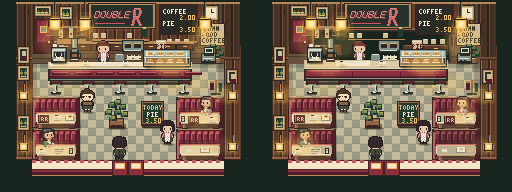
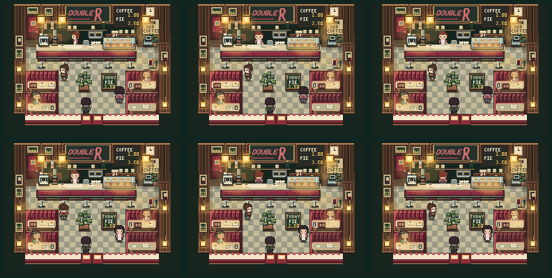

# Double R — room beauty + vitality pass

**CANDIDATA GIOCABILE.** Immagini sotto: render reali del gioco, canvas nativo 256×192, camera `diner (6,8) up`, narrativa attiva. Nessun mockup.

## Prima | dopo



[Confronto ingrandito 3×](vitality-pass/final/before-after-3x.png)

Pass finale cambia stanza intera, non solo crop booth:

- fondale servizio: unico recess scuro, cornice legno, meno righe decorative;
- bancone: piano, bordo e fronte leggibili come masse diverse;
- Norma: superficie libera e contrasto locale rendono credibile zona lavoro;
- booth: stessa costruzione, ma tavoli occupati, pronti e sparecchiati hanno pesi diversi;
- area centrale: resta calma, attraversabile, senza clutter nuovo.

## Vita nel tempo



[Gesto servizio ingrandito 4×](vitality-pass/final/wipe-service-4x.png)

Ingresso osservato per 30 secondi con clock reali e seed fisso. Prima azione leggibile: Norma pulisce piano. Segue pausa. Più tardi cliente solleva tazza. Percolatore, vapore, lampade, neon, vetro e orologio mantengono clock indipendenti. Nessun impulso sincronizzato.

## Provala

Branch: `codex/intent-room-double-r-grid`.

Da radice worktree:

```sh
python3 -m http.server 8000
```

Gioco: `http://localhost:8000/index.html` e ingresso Double R dalla città.

Anteprima diretta, utile solo per confronto: `http://localhost:8000/test/retro-scene.html?map=diner&x=6&y=8&dir=up&narrative=1`.

## Integrità e limiti

Mappa, collisione, porte, Cast Presence, narrativa, camera e `environment.program` restano canonici. Pass modifica disegno nativo e tempi/forme di attività già possedute da Ambient Life e Character Activity.

Gate finali: renderer 54/54, props 24/24, reachability 42/42 e 8/8, smoke 415, walkthrough 85 fino finale, Chrome Act 4 route C 130/130. Tutti PASS.

Limiti onesti: fondale scuro resta fascia orizzontale forte; stanza conserva ritmo quasi bilaterale; gesti richiedono breve pausa per essere notati. Nessun playtest umano prova ancora “voglio fermarmi”.

[Report completo](../../reports/intent-room-double-r-vitality.md) · [critic cieco finale](vitality-pass/review/final-blind.md) · [manifest cattura Chrome reale](vitality-pass/final/cdp-real/manifest.json) · [studio precedente, superato](new-pass/final/full-room-native.png)
