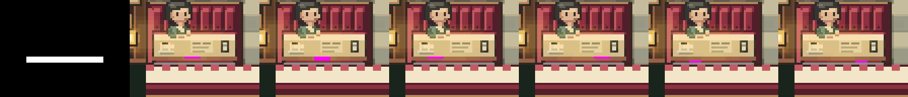
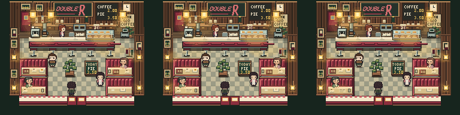

# Double R booth — exact-grid review

Start here. Images below are native-raster **mockups**, not new game assets. Columns always read **BASE | A | B | C | D | E | F**. Please judge first at native 1×; 4× exists to inspect individual pixels.

## 1. Six local variants

## 2. Protected area and exact changes

White mask = editable: x=13–50, y=28–30 within 64×48 occupied-booth crop. Black = protected. Magenta = pixels changed by each candidate.

[Mask over original booth](occupied-mask-overlay-4x.png) · [Manifest](manifest.json) · Exact per-pixel changes: [A](A.json), [B](B.json), [C](C.json), [D](D.json), [E](E.json), [F](F.json).

## 3. Room context

Comparison order **BASE | B | D**. B and D are cropped-pixel composites marked **MOCKUP**; rest of frame is unchanged. They were selected to test a central and an off-center treatment, not promoted as winners.

## Review question and outcome

Does any variant make the table/seat separation clearer at normal game scale **without** weakening the approved booth? Lead's current answer: **no**. A–D are effectively invisible in full-room context; E/F add a small artificial notch. No production renderer change, no refinement, no merge, no push. Please judge visually rather than treating baseline as automatically perfect.

[Short technical report](../../reports/intent-room-double-r-exact-grid.md) contains scope, test results and model roles. This folder contains source mask, all six original variants, exact diffs, reproducible scripts and verification JSON.
