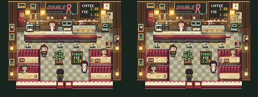
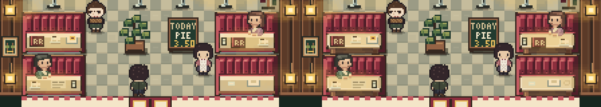
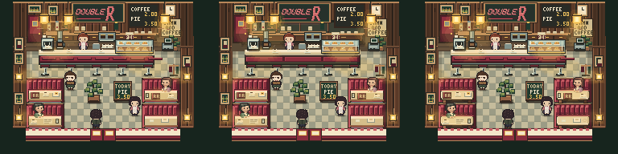

# Double R — candidata artistica giocabile

**CANDIDATA SPERIMENTALE · NON APPROVATA.** Le immagini sotto sono **RENDER DEL GIOCO**, non mockup. Stessa camera `diner (6,8) up`, narrativa attiva, canvas nativo 256×192; nel browser è mostrato a 3×.

## BASE | CANDIDATA

[Stesso confronto alla scala normale 3×](new-pass/final/full-room-3x.png)

## Due direzioni nel renderer

**A — servizio** ([checkpoint `b5480aa`](https://github.com/ember-mind/twin-peaks-game/commit/b5480aa)): fondale di lavoro incassato, armadi più grandi, bancone con piano e fronte separati. Guadagna profondità; resta una fascia orizzontale lunga. [Dettaglio A](new-pass/comparison/service-3x.png).

**B — booth** ([checkpoint `48be4f5`](https://github.com/ember-mind/twin-peaks-game/commit/48be4f5)): imbottitura verticale più arrotondata, tavolo con bordo girato, base arretrata e contatti con gli ospiti. Ha maggiore effetto sui quattro moduli nel frame intero. Due finiture: sottopiano meno nero [`2e654fc`](https://github.com/ember-mind/twin-peaks-game/commit/2e654fc), luci rosse meno invadenti [`dfe16e1`](https://github.com/ember-mind/twin-peaks-game/commit/dfe16e1). La candidata mantiene **B**, non somma A.

Il tavolo ora si stacca meglio da seduta e supporti, soprattutto a 3×; a 1× il guadagno è più sottile. Una review cieca ha preferito questa costruzione, segnalando accenti rossi troppo forti: ultimo passaggio li ha attenuati. Non è una prova che tutta la stanza sia migliore. Bancone, fondale, animazioni e geometria giocabile finali restano quelli della baseline. [Stato Act 4](new-pass/final/states/act4-promise-made-native.png) · [booth pronti, occupati e sparecchiati](new-pass/final/states/no-narrative-booths-3x.png).

## Provala

Checkout del branch `codex/intent-room-double-r-grid` (baseline recuperabile in `bf012a5`). Dalla radice del repo: `python3 -m http.server 8000`; apri `http://localhost:8000/index.html`, carica/gioca fino al Double R ed entra dalla porta di città. Anteprima diretta, non sostitutiva del percorso giocabile: `http://localhost:8000/test/retro-scene.html?map=diner&x=6&y=8&dir=up&narrative=1`. Confronta soprattutto i quattro booth entrando, avvicinandoti ai tavoli e uscendo.

Solo `js/retro-authored.js` cambia in produzione: mappa, collisione, porte, Cast, narrativa, camera e attività restano canonici. Test finali: **11/11 script Node PASS**, inclusi smoke 415/415, retro-production 54/54, props 24/24, reachability 42/42 e walkthrough fino al finale (85 acquisizioni); Chrome Act 4 `--path=C` **130/130 PASS**, con ingresso, interazioni e uscita dal diner. Nessuna animazione modificata; quindi nessuna clip nuova attribuita alla candidata. [Brief](new-pass/BRIEF.md) · [manifest del confronto](new-pass/final/manifest.json) · [review cieca](new-pass/review/RESULT.md).
