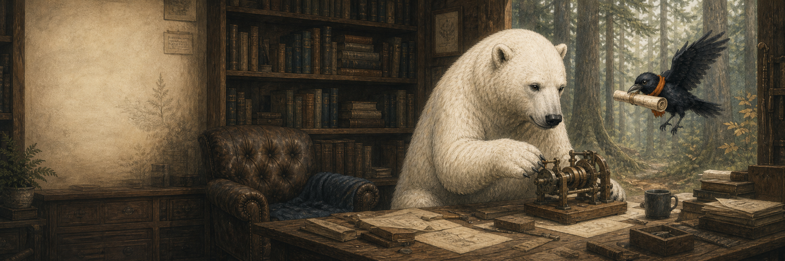
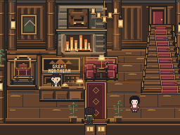
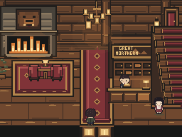
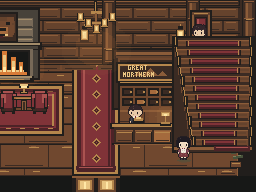
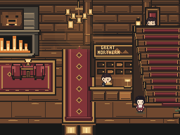

# Our hotel had everything. So why did arrival feel wrong?

*From The Ember Mind workshop: a room-repair exercise you can use in your own game.*



Our pixel-art hotel passed collision checks. Its entrance carpet still pointed toward the lounge chairs.

There was a fireplace, a reception desk, a clerk, red upholstery, lamps and stairs. Each object was recognizable. Together, they made an awkward place to arrive.

Before reading our diagnosis, look at the old entrance view. Where would you check in? Where would you wait? Which part looks like the route upstairs?



Crow arrived at the workbench with a rolled sketch for three more lamps. Bear had the lobby open beside his tools.

> **Crow:** “These could go beside the fireplace.”
>
> **Bear:** “Leave them here. Follow this carpet from the door.”
>
> **Crow:** “Are we checking in or sitting down?”

Bear traced the arrival line on the sketch. Then he put the lamps aside.

This time, we needed to work on the room around the objects.

## Start with a person arriving

A guest comes in carrying a bag. They need somewhere to ask for a room, somewhere to pause, and a way upstairs. The clerk needs a work side of the counter. Someone sitting by the fire should not feel parked in the traffic stream.

Now add the experience we want: warm, established, welcoming, with a little lodge character. A perfectly efficient corridor would miss that intention too.

Our brief became:

> Arriving guests should understand reception and upstairs as choices, with a sheltered place to wait beside the fire.

You can write this before touching an editor. Include both what people do and what the place should feel like. “Hotel lobby” names a room type; it does not make its design decisions.

## Give objects company

We stopped reviewing the desk, chair and rug as separate assets for a moment. We looked at the groups they should form.

Reception needed the counter, clerk, work-side storage, sign, lamp and a clear guest approach. The lounge needed the hearth, two seats, their shared table and a rug that gathered them into one resting place. Stairs needed a recognizable approach connected to the actual upstairs exit.

**A group is a small composition with a shared intention.** It does not need a new engine entity. You can sketch it on paper or mark it on a screenshot.

The lounge rug contributes something different from the entrance runner. One says, visually, “this is a place to settle.” The other links arrival to the room beyond. Putting both beneath unrelated furniture weakens that distinction.

Clustering related details is established environment-art practice. The Level Design Book connects it to readability: players need to understand a place, not parse every asset separately. Here we apply it to a small 2D room. [Environment Art](https://book.leveldesignbook.com/process/env-art)

## The repair: waiting left, service right, arrival between

The recorded rebuild moved the hearth and lounge to the left, reception toward the right service edge near the stairs, and luggage closer to service. It also widened the map by two tile columns so those relationships had room to work.



Compare the two entrance images. The useful change is larger than any extra decorative pixel:

- **Waiting has its own pocket.** Chairs and table sit together on a separate rug, outside the main arrival line.
- **Reception belongs to a service group.** Clerk, counter and storage read together, with public floor in front.
- **Open floor separates activities.** It gives the eye and the player space between the larger masses.

Zoom out until the little props stop reading. Do those larger shapes still form a convincing arrangement? If the composition falls apart at that scale, adding mugs and papers will not repair it.

A freestanding reception could fit a different lobby. Here, a perimeter arrangement better supports the entrance view and guest/staff separation. Copy the reasoning, not the right-hand placement.

Moving artwork alone can leave an invisible desk to collide with. This rebuild moved art, collision, lobby connections and affected actor positions together. Check those dependencies in your engine.

## Crow brings a plant

> **Crow:** “I found something for that corner.”
>
> **Bear:** “The plant can stay. That wall needs a softer shape.”

An object does not need a practical job to deserve its place.

A plant can interrupt repeated straight lines. A lamp can hold a small warm accent. A bear head can give a lodge a memorable silhouette. A quiet patch of floor can let those accents breathe.

Ask **“What would this room lose without it?”**

“Visual balance” is a valid answer. So are warmth, rhythm, character and depth. “It makes the screenshot more crowded” deserves another look. That is a review question, not permission to delete every nonessential object.

A useful contribution is specific: “This plant softens the rigid edge beside reception” tells you what to inspect. “This plant adds atmosphere” gives you much less to work with.

## Then the camera found our next mistake

Crow unrolled a wider version of the plan. Bear laid the game's view over it and moved that frame toward the upstairs entrance. The fireplace slipped out of view.

That is also what happened in the actual rebuilt room. The entrance frame looked clearer, but the hall-return camera cropped much of the left hearth:



The next recorded correction biased the hotel camera slightly west at that return position:



More lounge became visible without losing the stair reading. The frame still leans right, and repeated wall and stair lines remain strong. There is more composition work to do.

Widening was useful here, but it introduced a viewing problem. A bigger map does not give the player a bigger screen. Check entrance, return and important interaction positions—not only the whole-map plan.

The Level Design Book recommends testing foundational shapes through playable blockouts. In 2D, we can walk the tile layout and inspect its cameras before investing in detail. [Blockout](https://book.leveldesignbook.com/process/blockout)

## Try this on one room of your own

Set aside **twenty minutes for diagnosis**, not a promise to finish the art.

1. **Capture arrival.** Use the real player camera. Write where you think attention goes; treat that as a hypothesis.
2. **Write one intention.** “This place should feel ___, while making ___ easy to understand.”
3. **Mark three or four groups.** Name their role and visual character: warm/dense lounge, quieter arrival, compact service area. Ignore tiny props at first.
4. **Find one contradiction.** A path ends at furniture; a bright secondary mass overwhelms the intended focus; a waiting group straddles circulation. Choose something visible, not “needs more atmosphere.”
5. **Propose one bounded change.** Move a group, simplify a silhouette, quiet repeated contrast or strengthen a local accent. Do not add a shelf of props by default.

Then build and test that change. For a simple contrast trial, keep camera and world state the same. If an entrance moves, compare the equivalent arrival experience and record the difference. Our historical rebuild changed several things together; its screenshots cannot isolate each one's effect.

Use this small decision card:

```text
Room intention:
Visible contradiction:
Change I will try:
What should improve in the image:
What could break in play or another camera view:
Observed result / keep or revert:
```

Afterward, walk the routes. Ask someone unfamiliar with the room where they would go and what told them. Do not point out reception first. A lucky guess differs from a choice they can explain.

If routes work but the composition does not improve, keep the baseline and try a different hypothesis. We are designing a place, not collecting successful test counts.

Bear pinned the entrance frame beside the hall-return frame. Crow's lamp sketches stayed on the bench. The next question was already visible: should those bright wall lines be quieter?

If you try the exercise, share your two frames and one decision sentence: **“I changed ___ because ___; the result was ___.”** That is enough for a useful design conversation.

---

### Workshop notes

Bear and Crow's exchanges are editorial fiction, not recorded playtester reactions or game dialogue. The workshop illustration is existing studio artwork. The four game images are real 256×192 canvas captures of historical revisions, not the latest production lobby. This post explains an existing repair; it introduces no new room art.

Both the flawed and rebuilt layouts passed their focused scene, location and door checks, smoke tests (415/415), and simulated walkthroughs (85 acquisitions). That establishes useful engineering evidence, not a human preference result or proof of exceptional beauty. Full provenance, warnings and commands live in the [case-study evidence](room-method-lobby-case-01.md) and [capture manifest](../artifacts/room-method-lobby-case/manifest.json). [Open the larger image comparison](../artifacts/room-method-lobby-case/index.html).
