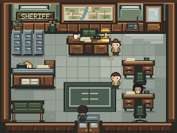
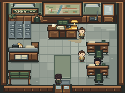
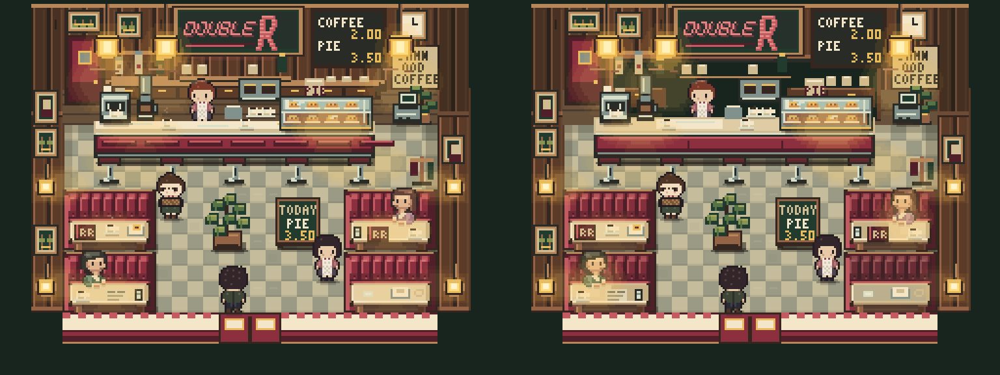

# Why this room looks this way

Editorial status: draft devlog, not published. Based on repository studies reviewed on 2026-09-26. The experiments use a 256×192 pixel canvas. Historical screenshots show the tested versions; they are not a claim that every experimental system is in the current production build.

---

The most useful question in our room-design experiments started with a hotel reception desk.

It had the expected objects: a counter, a clerk, a sign and storage. But in the playable view, reception projected into the arrival space. The objects looked individually plausible while the room felt wrong.

Where would a guest stop? Where would staff work? How would someone reach the stairs without walking through another activity?

That observation led us to study rooms as places, compositions and little stretches of everyday life.

## Give the room an intention

Our game already knew about maps, furniture, doors and characters. We added a small authoring description to an existing environment: `environment.program`.

The Program and its inspector currently live on the research branch. Production selectively received diner art and activity changes; it has not integrated the Program foundation.

It describes what the place should communicate, what normally happens there, its visual goals and its important groups. Selected elements have short contribution explanations. A plant can soften an institutional silhouette. A rug can guide the eye. Repeated booths can establish the social scale of a diner.

The useful question became: **what does this contribute?**

Aesthetic contributions count. A beautiful room can contain something impractical because its shape, color or placement makes the whole composition better. Intent helps explain the choice; the rendered room still has to justify it.

The description also stays modest. Maps own geometry. Doors own connections. Cast Presence owns named characters. Narrative Runtime owns story truth. Our design notes refer to those things without becoming a second simulation.

## Test the room you can see

At the Sheriff's Station, our description called for a warm work area and a clear approach. The real image gave a broad central rug more attention than we wanted.

*Actual native game frame before the pilot.*

We tried removing the rug. It made the room quieter, but an independent comparison preferred the original: our empty floor had lost useful structure. A narrower runner gave us a better answer. Together with a recessed work-wall panel, it connected the entrance to the rear workspace.

*Actual native game frame after the visual pass. The desk's warm-focus goal remains only partly achieved.*

That failure mattered. Negative space is a compositional resource, and it needs a shape and a purpose too.

The hotel lobby revealed a different problem. More attractive surfaces could not fix furniture positioned against the room's use. Its later rebuild widened the map, separated lounge and reception, and kept staff circulation and the route upstairs connected. We checked both entrance and hall-return views because a wider map does not all fit inside the camera.

The drawing, collision and player view needed to describe the same place.

## Keep the method; change the answer

Double R tested whether the station's reasoning could transfer to a diner.

It needed several social destinations. Four related booths were part of its identity. A dense counter could convey hospitality and work. Copying the station's single warm focus and quiet center would have weakened those qualities.

Our first diner changes were small: softer floor values and adjusted booth lighting. Several later furniture alternatives failed. More explicit legs and physically sensible tabletop geometry did not necessarily produce better pixel clusters at game size.

We also tried image-generated booth studies. They produced ideas, but the tested edits drifted from the native grid and changed surrounding characters or context. None became an approved game asset. That result describes this constrained experiment, not every possible use of image generation.

*Baseline left; generated study and refinement in the middle and right, sampled to the native grid and enlarged 4×. These are unapproved mockups, not new game renders.*

The stronger room-scale candidate addressed the service area. A darker work recess separated wall, usable workspace and public counter. Existing tools and Norma now belonged to one clearer composition. Different table states varied the repeated seating without adding decorative clutter.

*Real game captures, enlarged with nearest-neighbor scaling. Baseline left; accepted experimental candidate right.*

The gains were clearer material planes, group coherence and more readable everyday activity. The room retained much of its original overall arrangement.

## A room also exists in time

A coffee machine, a staff gesture and a customer drinking can make a room feel occupied. They can also become conspicuous loops or repeated opening choreography.

We tested five independent entries and three stationary observations lasting over 90 seconds each across different canonical Cast states. Three leave-and-return cycles were tested within one baseline session.

Norma's action remained invisible when she was absent. Re-entry resumed the diner clocks instead of replaying the opening. Machine and human activity sometimes overlapped coherently. Quiet intervals remained.

One concern survived: fresh visits repeatedly put the staff gesture before the guest's sip. We recorded a possible small timing adjustment and kept the candidate frozen for human playtest.

Everyday life allows simultaneous actions. Timing review needs to examine readability, plausibility and repetition rather than reward a tidy sequence for its own sake.

## What we can claim so far

We have a useful authoring extension, real visual improvements, preserved rejected studies and a process that makes decisions inspectable.

One reproducibility debt also remains: the saved 90-second observations used capture-tool options that were not retained in the committed harness. Their frames and manifests survive, but the exact protocol needs its tooling restored before another author can rerun it.

We still need player evidence. A critic preferring an image does not tell us whether someone understands a room better or wants to stay. Our final vitality review also gave the candidate richer motion evidence than the baseline, so its numerical scores cannot establish the size of a temporal improvement.

The next experiment is to give another author a short brief and this process, then test a contrasting room with unfamiliar players. Can they build a convincing place within a bounded number of iterations, and can players understand and remember it?

The emerging method is small: state the intent, compose the uses and visual groups, build in the real camera, test broad shapes before details, recognize existing signs of life, and keep changes only when the room benefits.

Our working question remains: **why is this place designed this way—and can the player feel that answer?**

---

## Publication notes

Publish as a development case study. Do not claim automatic room generation, universal beauty, AAA parity, player retention or a proven productivity gain. Include failures; they explain why the process changed. Obtain human observations before adding claims about comprehension, enjoyment or spontaneous lingering.

Suggested image sequence: hotel placement failure/rebuild, Sheriff before/after, one rejected booth comparison, Double R before/after, matched motion clips. The article currently embeds existing Sheriff and Double R evidence. Hotel evidence is available on [reviewed main](https://github.com/ember-mind/twin-peaks-game/blob/7a3de3fd249cc908756a269e116c597bc82f1767/reports/gauntlet-e8-lobby.md); label historical versions and game captures clearly.

For temporal publication evidence, give baseline and candidate matching duration, state, scale and route. A six-frame sheet can illustrate an action but cannot establish its natural timing or smoothness.

Sources: [study review](room-method-review.md), [Sheriff visual pass](intent-room-sheriff-visual-pass.md), [Double R Program experiment](intent-room-double-r.md), [rejected booth craft](intent-room-double-r-craft.md), [image-generation experiment](intent-room-double-r-visual-first.md), [room beauty and vitality](intent-room-double-r-vitality.md), [temporal stress test](intent-room-double-r-temporal-naturalness.md).

### Short social excerpt

We started with a hotel reception desk that had all the right objects but occupied the wrong part of the room.

That sent us through a series of pixel-art room experiments: a sheriff's station, a diner, several rejected furniture designs, and real-time observations of everyday activity.

The useful question became “what does this contribute?” A plant can provide visual balance. Repeated booths can establish identity. Empty space can guide movement. None of those choices is automatically good until it works in the player's view.

We now have a small room-authoring method and a playable diner candidate awaiting human feedback. The interesting part is the evidence—including the designs we chose not to ship.
