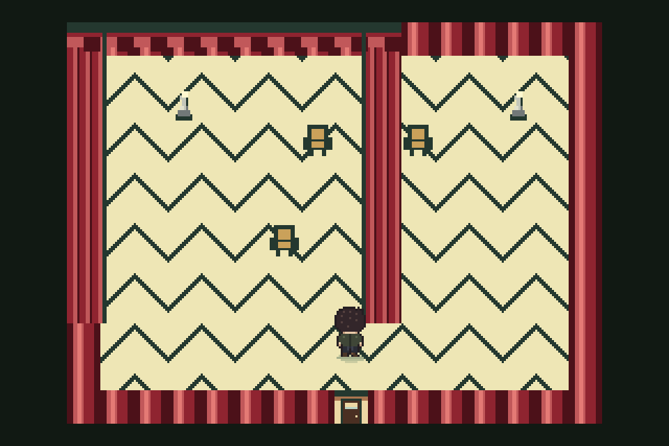
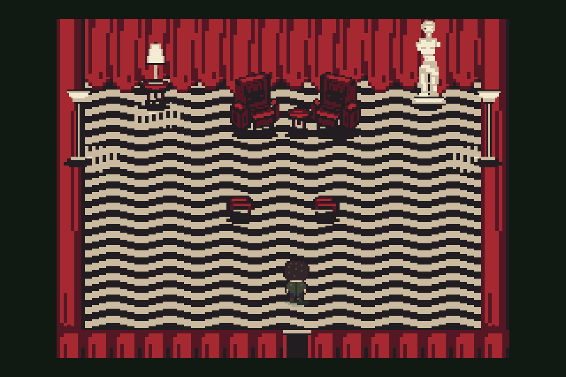

# Gauntlet E7 — Red Room

## Outcome

Native Red Room scene shipped on `qwen/night-art-e7-redroom`, based on main
`485feabba6e23c313749bec52e24e66113dd8ee7`. All structural, production,
narrative, door, and browser gates pass.

Visual gauntlet verdict: **BAR_WINS**. Curtains met the 7/10 floor. Chevron
floor, furniture + statue, and light stopped at the four-round cap and ship
their best 6/10 rounds. Those three units are plainly below floor.

No push performed.

**E7b follow-up:** floor result below is historical E7 evidence. E7b supersedes
that unit with a 7/10 pass; see [E7b floor](#e7b-floor).

## Fixed evidence

Capture command for every scene frame:

```sh
test/shot.sh redroom 8 9 up <out> --retro
```

Reference crop uses only the top panel of `assets/ref/red-room-sheet.png`.

| Evidence | File | SHA-256 |
|---|---|---|
| Reference top panel | `artifacts/art-pass-e/e7/reference-top.png` | `3edc460bccad0ae2f21242e851e13c9a5fbe6d36d4b652f7fac8e1be7e9a65ff` |
| Before | `artifacts/art-pass-e/e7/baseline.png` | `02c3be30f1fad62c1c645d74a09003a618bae8262dd37e4b302d79d9590a0903` |
| After, shipped mix | `artifacts/art-pass-e/e7/after.png` | `beb1b822df2ea4393f02e97373c57a75c692c92a18866700ce83f81553156c09` |

### Before



### After



## Unit results

| Unit | Scores by round | Rounds used | Shipped round | Shipped score | Floor met? | Stop reason |
|---|---|---:|---:|---:|---|---|
| Curtains | 5 → 7 | 2 | 2 | 7/10 | Yes | Floor reached; stopped immediately |
| Chevron floor | 5 → 6 → 6 → 3 | 4 | 2 | 6/10 | **No** | Four-round cap; restored best round |
| Furniture + statue | 3 → 6 → 6 → 5 | 4 | 3 | 6/10 | **No** | Four-round cap; restored best round |
| Light | 4 → 4 → 4 → 6 | 4 | 4 | 6/10 | **No** | Four-round cap |

### One-gap critic history

| Unit / round | Rank vs previous | Score | Critic's one gap |
|---|---|---:|---|
| Shared R1 | Better than baseline | Curtains 5, floor 5, furniture 3, light 4 | Furniture arrangement lacks readable armchairs, central table and figure, and detailed statue. |
| Furniture R2 | Better | 6 | Chairs and tables remain flatter, blockier, and less richly shaded than reference furniture. |
| Furniture R3 | Better | 6 | Furniture remains too dark and blocky, lacking readable shading and dimensional chair details. |
| Furniture R4 | Worse | 5 | Furniture is saturated bright red and visually flat versus reference's dark dimensional chairs and table. |
| Curtains R2 | Better | 7 | Curtain folds remain coarse and flat versus reference fabric texture. |
| Floor R2 | Better | 6 | Evenly spaced horizontal chevrons lack reference's large perspective-driven zigzag variation. |
| Floor R3 | Same | 6 | Chevrons remain too dense and uniformly scaled versus reference's larger perspective pattern. |
| Floor R4 | Worse | 3 | Chevrons became too sparse and oversized versus reference. |
| Light R2 | Better | 4 | Lighting remains uniformly flat and overbright, lacking localized light and deep shadows. |
| Light R3 | Worse | 4 | Lighting became too dark and high-contrast versus reference's broad cream illumination. |
| Light R4 | Better | 6 | Lighting remains too flat and uniform versus warm dimensional spotlight and shadow falloff. |

Every critic saw only `reference-top.png`, previous/before PNG, and candidate/after
PNG. No source, prompt history, or builder reasoning was provided.

## Agents used per round

Builder stayed separate from every judge: Astra, high reasoning,
`/root/e7_builder`. Each critic was a new Luna high-context process. No xhigh
reasoning was used.

| Sequence | Unit round | Builder | Fresh critic |
|---:|---|---|---|
| 1 | Shared R1 | Astra/high `/root/e7_builder` | Luna/high `/root/e7_critic_r1` |
| 2 | Furniture R2 | Astra/high `/root/e7_builder` | Luna/high `/root/e7_critic_furniture_r2` |
| 3 | Furniture R3 | Astra/high `/root/e7_builder` | Luna/high `/root/e7_critic_furniture_r3` |
| 4 | Furniture R4 | Astra/high `/root/e7_builder` | Luna/high `/root/e7_critic_furniture_r4` |
| 5 | Curtains R2 | Astra/high `/root/e7_builder` | Luna/high `/root/e7_critic_curtains_r2` |
| 6 | Floor R2 | Astra/high `/root/e7_builder` | Luna/high `/root/e7_critic_floor_r2` |
| 7 | Floor R3 | Astra/high `/root/e7_builder` | Luna/high `/root/e7_critic_floor_r3` |
| 8 | Floor R4 | Astra/high `/root/e7_builder` | Luna/high `/root/e7_critic_floor_r4` |
| 9 | Light R2 | Astra/high `/root/e7_builder` | Luna/high `/root/e7_critic_light_r2` |
| 10 | Light R3 | Astra/high `/root/e7_builder` | Luna/high `/root/e7_critic_light_r3` |
| 11 | Light R4 | Astra/high `/root/e7_builder` | Luna/high `/root/e7_critic_light_r4` |

Critic notes and corresponding PNGs live under
`artifacts/art-pass-e/e7/<unit>/round-<n>{-critic.md,.png}`.

## Round commits

| Sequence | Unit round | Commit |
|---:|---|---|
| 1 | Shared R1 | `3bc873b9a3668f7d0b9a7cf4d81ee8fe0d9f0ac9` |
| 2 | Furniture R2 | `04b199510ab52d932406c80b2840afd8701aa511` |
| 3 | Furniture R3 | `0ac20d0173be7fa61168c448bbe3bccee6f29e84` |
| 4 | Furniture R4 | `74ab83db1dc631a8419cc17ddf43093c2cfa4936` |
| 5 | Curtains R2 | `c9cfdc38fbcc419b811d1c3a5c1c713849913c24` |
| 6 | Floor R2 | `8f8a00b35558a5919cfbd8a9a91369dfd1e969be` |
| 7 | Floor R3 | `af1e180730e543781a9c215a1dcb66caca16b7e3` |
| 8 | Floor R4 | `56c8b9ef0d351eb450001956b11f5ad9d8193311` |
| 9 | Light R2 | `3489c2e67c6903187c2d4a543b4b5e4b04efdd16` |
| 10 | Light R3 | `d130af3a3866146b8681f1ceab9f7fd53fab8fb8` |
| 11 | Light R4 | `41aa1048175943b7e7eaf8308bb9341487d1e2e4` |

## Locks and vetoes

| Lock / veto | Result | Evidence |
|---|---|---|
| `redroom` map rows unchanged | Pass | Installer compares exact 12 authored rows and throws `RedRoomScene: authored rows diverge`; `js/maps.js` unchanged. |
| Every door unchanged | Pass | Scene installer neither asserts nor writes doors. Focused test installs before doors exist, adds the finale redirect later, and verifies it survives uninstall/reinstall. `world-door-equality` passes 59/59. |
| Cast Presence body tiles walkable | Pass | Laura `(11,2)`, MFAP `(8,4)`, BOB `(14,2)` validated from cast registry; entry spine `(8,4..11)` validated walkable. |
| Five-color maximum | Pass | Exactly `#541824`, `#a62932`, `#caba9f`, `#211d21`, `#f4ebd5`; focused renderer test rejects any sixth hue. Sprite palette remains separate. |
| Ambient archetypes only | Pass | Curtain sway uses `MACHINE_IDLE_ACTIVITY` with slow three-position column shift. Three lamps use `LIGHT_WARM_VARIATION`. 60-second deterministic ambient test passes. |
| Protected renderer files untouched | Pass | Hashes below equal preflight hashes. |
| Sixth hue | No veto triggered | Scene and ambient draws stay opaque inside exact five-color set. |
| Geometry / door / cast mutation | No veto triggered | Fail-loud tests and full gate suite pass. |

Protected file hashes:

| File | SHA-256 |
|---|---|
| `js/retro.js` | `1cb8b6bf039ca15177fec2aa1f97d50e3bd939798ec909c0fad8c918fba2c898` |
| `js/retro-authored.js` | `cf9d6a00470d8606d13ced5f86ce3714071a6eccfc07751093e60223e005934b` |
| `js/tiles.js` | `7f644bd1254dd1959fcd9b9f901fdaed354d42d1e278ecd5bc2892a907531378` |
| `js/maps.js` | `9af6bc23841e4e8bcb73f83926a3a0480f63a8b06950225b3cd52f0931ff46b9` |

## Files

Runtime and tests:

- `js/redroom-art.js`
- `js/redroom-scene.js`
- `js/redroom-production.js`
- `js/ambient-life-scenes.js`
- `index.html`
- `test/retro-scene.html`
- `test/redroom-scene.js`

Evidence and run state:

- `artifacts/art-pass-e/e7/**`
- `.gauntlet/e7/contract.json`
- `.gauntlet/e7/progress.md`
- `.gauntlet/e7/evidence/**`
- `.gauntlet/e7/evidence-manifest.json`
- `reports/gauntlet-e7-redroom.md`

Protected files have no branch diff.

## Gate table

All commands ran after final shipped visual mix was restored. Browser-regenerated
tracked artifacts were restored afterward; only E7 evidence remains changed.

| Gate | Result | Evidence |
|---|---|---|
| `node test/smoke.js` | Pass | 415/415 |
| `node test/walkthrough.js` | Pass | 85/85 |
| `node test/retro-production.js` | Pass | 54/54 |
| `node test/mobile-production.js` | Pass | 20/20 |
| `node test/cast-continuity-validate.js` | Pass | Validator green |
| `node test/narrative-finale.js` | Pass | 27/27 |
| `node test/act-4-flow.js` | Pass | 1611/1611 |
| `node test/world-door-equality.js` | Pass | 59/59 |
| `node test/redroom-scene.js` | Pass | Geometry, cast, doors, hooks, five colors, floor phase, 60-second ambient, lifecycle |
| `node test/act-4-playthrough.js --path=all` | Pass | Chrome, 530/530. One harness-recorded `favicon.ico` 404, no path browser errors. |
| `node test/act-3-playthrough.js` | Pass | 189/189; one test-server `favicon.ico` 404 |

## Final disposition

Engineering and continuity gates: **PASS**.

Visual floor: **FAIL**. Curtains 7/10; floor 6/10; furniture + statue 6/10;
light 6/10. Per-unit round caps reached, so gauntlet stops and reports the bar
winning instead of claiming parity.

Gauntlet baseline audit passes. Release audit fails only on the three recorded
below-floor units and their resulting final-floor/verdict/high-gap checks.

## E7b floor

E7b continued from E7 HEAD on the same branch and rescoped the loop to one
unit: Red Room floor. Result: **PASS, 7/10 in round 1**. Loop stopped
immediately; no color-tuning rounds were needed.

### Mechanical correction

`floorColor(x, y)` now implements the supplied map-pixel formula exactly:

```text
v = abs((x mod 16) - 8)
band = floor((y + v) / 4) mod 2
colour = band ? chevron_near_black : chevron_cream
```

Floor renderer changed from 2px horizontal runs to 1px pixels. Without this,
odd `x` columns could not obey the formula. Tests exhaustively compare every
pixel in the 256×192 map space, prove the 16px period, 4px bands, palette
mapping, and camera-translated production draw stream.

No perspective scaling or density tuning exists. Optional lower-row darker
cream was skipped because E7 palette already consumes all five allowed scene
colors; adding it would trigger the sixth-hue veto.

### Evidence and critic

| Item | Result |
|---|---|
| Before | `artifacts/art-pass-e/e7b/floor/before.png` — SHA-256 `beb1b822df2ea4393f02e97373c57a75c692c92a18866700ce83f81553156c09` |
| Round 1 | `artifacts/art-pass-e/e7b/floor/round-1.png` — SHA-256 `17d406345caef69d942d21700f5d8b678b67e206950440781f0e9a8451f77fbb` |
| Builder | Astra/high, `/root/e7b_builder` |
| Critic | Luna/high, fresh context, `/root/e7b_critic_r1`; reference top + before + after PNG only |
| Score | 7/10 |
| Rank | BETTER |
| One gap | Zigzag bands remain denser and thinner than reference's broad pattern. Geometry stayed unchanged because formula is locked. |
| Shipped round | Round 1 |
| Commit | `531817ece5089ead6fba5cdc863cfc21eb332f6f` |

### E7b gates

| Gate | Result |
|---|---|
| `node test/redroom-scene.js` | Pass — exact formula, period, bands, palette, 1px production draw stream |
| `node test/smoke.js` | 415/415 |
| `node test/retro-production.js` | 54/54 |
| `node test/narrative-finale.js` | 27/27 |
| `node test/act-4-playthrough.js --path=all` | Chrome 530/530; one harness `favicon.ico` 404, no path browser errors |

Browser-regenerated tracked artifacts were restored after the gate. No push
performed.
