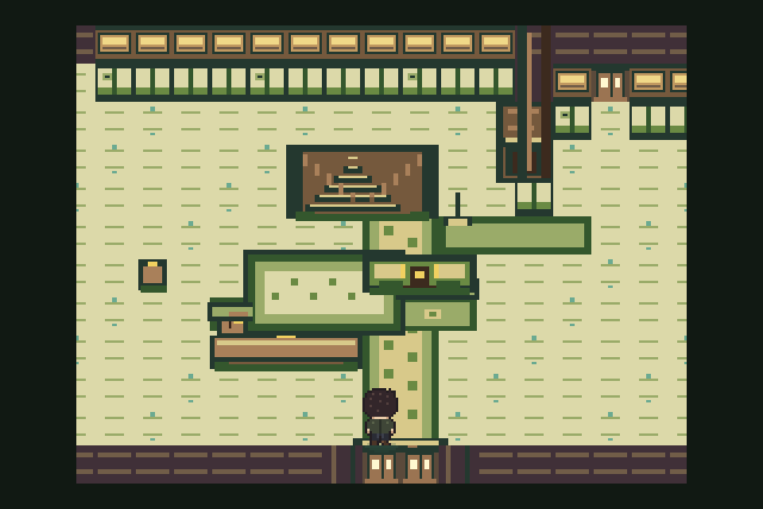
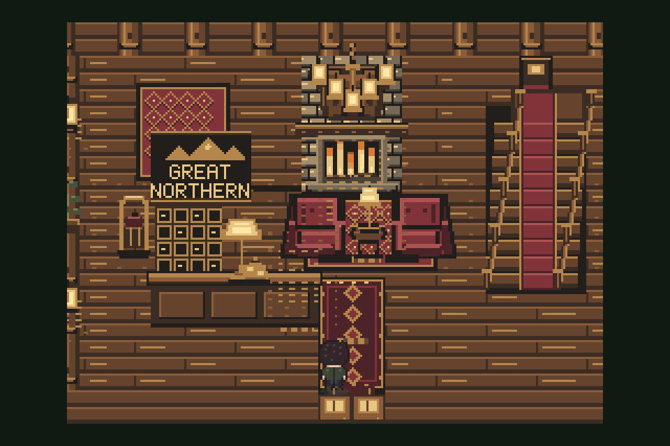

# Gauntlet E8 — Great Northern lobby

## Outcome

Native Great Northern lobby shipped on `qwen/night-art-e8-lobby`, based on main
`3be8f5615d955fbc9075966f27d122628ca0242a`. All structural, production,
continuity, Room 315, door, narrative, and browser gates pass.

Visual gauntlet verdict: **BAR_WINS**. Reception desk met the floor at 7/10.
Stairs + runner + chandelier met it at 8/10. Walls + floor + rugs (4/10),
fireplace corner (5/10), and light (4/10) stopped at the four-round cap and are
plainly below the required 7/10 floor.

No push performed.

## Fixed evidence

Every capture used the town-entrance spawn and fixed command:

```sh
test/shot.sh hotel_gn 8 10 up <out> --retro
```

Reference crop contains only the bottom panel of
`assets/ref/great-northern-lobby-sheet.png`.

| Evidence | File | SHA-256 |
|---|---|---|
| Reference bottom panel | `artifacts/art-pass-e/e8/reference-bottom.png` | `0e49c07239a1c4edfcb6a9bf981e321050582d6979cdc485f8a6e24025c4e8c7` |
| Before | `artifacts/art-pass-e/e8/baseline.png` | `3d0e261fb26a283a6a2ed4a7ddc3fe04290e12e98d9b4324f673d6adf50636fa` |
| After, shipped mix | `artifacts/art-pass-e/e8/after.png` | `1bd589265e792322bb00ffb80171cdd22f027551d0edf68fba2f7772e807fb3b` |

### Before



### After



## Unit results

| Unit | Scores by round | Rounds used | Shipped round | Shipped score | Floor met? | Stop reason |
|---|---|---:|---:|---:|---|---|
| Log walls + floor + rugs | 5 → 4 → 4 → 4 | 4 | 3 | 4/10 | **No** | Four-round cap; round 4 ranked worse, restored round 3 |
| Fireplace corner | 5 → 5 → 4 → 5 | 4 | 4 | 5/10 | **No** | Four-round cap |
| Reception desk | 5 → 6 → 6 → 7 | 4 | 4 | 7/10 | Yes | Floor reached; stopped immediately |
| Stairs + runner + chandelier | 6 → 5 → 8 | 3 | 3 | 8/10 | Yes | Score >=8; stopped immediately |
| Light | 5 → 4 → 4 → 2 | 4 | 3 | 4/10 | **No** | Four-round cap; round 4 ranked worse, restored round 3 |

All units stayed within four rounds and their 90-minute unit boxes. Total run
stayed inside the six-hour cap.

## One-gap critic history

| Unit / round | Rank vs previous | Score | Critic's one gap |
|---|---|---:|---|
| Shared R1 | Better than baseline | walls 5, fireplace 5, reception 5, stairs 6, light 5 | Scene remains much flatter and darker than reference's warm, richly dimensional lodge interior. |
| Walls R2 | Better | 4 | Flat top-down plank treatment lacks warm perspective depth and rich rug patterning. |
| Walls R3 | Better | 4 | Walls and floor read as flat horizontal-plank top-down surfaces instead of dimensional timber and warm perspective floor. |
| Walls R4 | Worse | 4 | Radial floor perspective lines conflict with reference's clean horizontal plank structure. |
| Fireplace R2 | Better | 5 | Defining stacked-stone surround is missing. |
| Fireplace R3 | Same | 4 | Top-down composition and side-by-side chairs miss the frontal fireplace with chairs flanking table. |
| Fireplace R4 | Better | 5 | Fireplace lacks unmistakable gray stone surround and bright readable flames. |
| Reception R2 | Better | 6 | Sign lacks mountain silhouette; pigeonholes, bell, and lamp remain vague or misplaced. |
| Reception R3 | Better | 6 | Desk remains small and low without reference's wide counter and clear surface props. |
| Reception R4 | Better | 7 | Lamp obscures pigeonholes instead of sitting at far right. |
| Stairs R2 | Better | 5 | Stair/runner reads narrow and detached instead of a broad right-side flight. |
| Stairs R3 | Better | 8 | Stair runner is too wide and slab-like versus reference. |
| Light R2 | Better | 4 | Composition and perspective remain unlike the wide frontal reference. |
| Light R3 | Better | 4 | Lighting remains flat and top-down without deep directional warm shadows. |
| Light R4 | Worse | 2 | Heavy dark banding further reduces readability. |

Every critic saw only `reference-bottom.png`, previous/before PNG, and candidate
PNG. Critics received no source, brief text, prompt history, or builder
reasoning.

## Mechanical specifications

Repeated gaps triggered exact pixel specifications, following the E7b lesson:

- Walls R3: 48×8 boards, 24 px alternating joints, exact bevel/face/seam
  tones, 8 px log courses, 8 px rug motif grid.
- Walls R4: explicit wall/floor plane split and integer perspective seams.
  Critic rejected this round; code returned to round 3.
- Fireplace R3: 48×66 stacked-stone surround, 8×6 staggered stones, fixed
  bear/mantel/firebox/hearth boxes.
- Fireplace R4: 31×31 mirrored chair boxes and centered stepped-oval table.
- Reception R4: 80×26 counter, 4×4 pigeonhole bank, fixed bell/lamp boxes.
- Stairs R3: 48×88 right-side flight, ten treads, continuous runner, fixed
  rail points, centered five-bulb chandelier.
- Light R3/R4: sparse receiving-light grids, then explicit tapered cones and
  cast-shadow scanlines. R4 banding failed and was reverted.

Specifications live beside their affected unit evidence under
`artifacts/art-pass-e/e8/<unit>/round-<n>-mechanical-spec.md`.

## Agents used per round

Builder remained separate from every judge: Astra/high,
`/root/e8_builder`. Each critic was a new Luna/high process with fresh context.
No xhigh reasoning was used.

| Sequence | Unit round | Builder | Fresh critic |
|---:|---|---|---|
| 1 | Shared R1 | Astra/high `/root/e8_builder` | Luna/high `/root/e8_critic_r1` |
| 2 | Walls R2 | Astra/high `/root/e8_builder` | Luna/high `/root/e8_critic_walls_r2` |
| 3 | Walls R3 | Astra/high `/root/e8_builder` | Luna/high `/root/e8_critic_walls_r3` |
| 4 | Walls R4 | Astra/high `/root/e8_builder` | Luna/high `/root/e8_critic_walls_r4` |
| 5 | Fireplace R2 | Astra/high `/root/e8_builder` | Luna/high `/root/e8_critic_fire_r2` |
| 6 | Fireplace R3 | Astra/high `/root/e8_builder` | Luna/high `/root/e8_critic_fire_r3` |
| 7 | Fireplace R4 | Astra/high `/root/e8_builder` | Luna/high `/root/e8_critic_fire_r4` |
| 8 | Reception R2 | Astra/high `/root/e8_builder` | Luna/high `/root/e8_critic_desk_r2` |
| 9 | Reception R3 | Astra/high `/root/e8_builder` | Luna/high `/root/e8_critic_desk_r3` |
| 10 | Reception R4 | Astra/high `/root/e8_builder` | Luna/high `/root/e8_critic_desk_r4` |
| 11 | Stairs R2 | Astra/high `/root/e8_builder` | Luna/high `/root/e8_critic_stairs_r2` |
| 12 | Stairs R3 | Astra/high `/root/e8_builder` | Luna/high `/root/e8_critic_stairs_r3` |
| 13 | Light R2 | Astra/high `/root/e8_builder` | Luna/high `/root/e8_critic_light_r2` |
| 14 | Light R3 | Astra/high `/root/e8_builder` | Luna/high `/root/e8_critic_light_r3` |
| 15 | Light R4 | Astra/high `/root/e8_builder` | Luna/high `/root/e8_critic_light_r4` |

Critic notes and PNGs live under
`artifacts/art-pass-e/e8/<unit>/round-<n>{-critic.md,.png}`.

## Round commits

| Sequence | Unit round | Commit |
|---:|---|---|
| 1 | Shared R1 | `134a7498cb23e995f9932784141e11c63e6eb291` |
| 2 | Walls R2 | `111e2259eff9bed3c5c0ffffd726030d3957bbc2` |
| 3 | Walls R3 | `9d0f9547bd4ea45638f20168ada26e319c706cd9` |
| 4 | Walls R4 | `4524c4e08d051008de9040b3a91cf2c7199fd8ee` |
| 5 | Fireplace R2 | `11f746299c503b08d45ced7f05b5d32af18d31fe` |
| 6 | Fireplace R3 | `cd4b269a584c62d5f3f5ead1cf9e42bd760e5b2f` |
| 7 | Fireplace R4 | `4a9377a6066514b8a70d8341eb162e9d1ebebe4d` |
| 8 | Reception R2 | `95be8414ead64bc1f4ec9c95879113eabaf7f721` |
| 9 | Reception R3 | `26e8c6f205618a102b0d8fa8e0dc27e191d6e3e8` |
| 10 | Reception R4 | `f255994d03994513240e163e2e44a5e0ed0a7cae` |
| 11 | Stairs R2 | `250dea755a167d3718c387057ad85d3fd387f68f` |
| 12 | Stairs R3 | `e04375da9d727d4d56b784dc1ba2b8f2abde4d01` |
| 13 | Light R2 | `36233e186a043fc1e01b3fa47804a6fea182e426` |
| 14 | Light R3 | `8ed258546ab8dbef77c6ea5798b4e66cdebd0976` |
| 15 | Light R4 | `c85731a3d7aff5f158c6915bc5c80c06268628de` |

Round 4 walls and light commits contain evidence/critic checkpoints while
runtime art was restored to each stronger shipped round.

## Locks and vetoes

| Lock / veto | Result | Evidence |
|---|---|---|
| `hotel_gn` map rows unchanged | Pass | Installer compares all 12 exact rows and fails loud; `js/maps.js` hash unchanged. |
| Registry records unchanged | Pass | Installer compares `town-great-northern-lobby` and `great-northern-room-315-hall` exact records; `world/connections.json` hash unchanged. |
| Doors not asserted at scene install | Pass | Focused test replaces `map.doors` with a throwing getter during install; installer never reads it. Registry doors install later and survive lifecycle checks. |
| Cast Presence body tiles walkable | Pass | Ben Horne `(5,7)` and Audrey `(12,9)` validated from narrative windows; routes and entry spine remain walkable. |
| Room 315 untouched | Pass | No Room 315 file diff; `room-315-location` gate passes including hall round trip. |
| Ambient archetypes only | Pass | Fire uses `MACHINE_IDLE_ACTIVITY` with three variants; chandelier uses `LIGHT_WARM_VARIATION`; bell uses `GLASS_SUBTLE_REFLECTION`. 60-second focused ambient test passes. |
| Protected renderer files untouched | Pass | Hashes below match preflight. |
| Geometry / registry / cast mutation | No veto triggered | Fail-loud focused tests and full gate suite pass. |
| Rejected visual regression | Veto applied | Walls R4 radial floor and light R4 heavy banding were captured/judged, then runtime code restored to stronger shipped rounds. |

Protected/data hashes:

| File | SHA-256 |
|---|---|
| `js/retro.js` | `1cb8b6bf039ca15177fec2aa1f97d50e3bd939798ec909c0fad8c918fba2c898` |
| `js/retro-authored.js` | `cf9d6a00470d8606d13ced5f86ce3714071a6eccfc07751093e60223e005934b` |
| `js/tiles.js` | `7f644bd1254dd1959fcd9b9f901fdaed354d42d1e278ecd5bc2892a907531378` |
| `js/maps.js` | `9af6bc23841e4e8bcb73f83926a3a0480f63a8b06950225b3cd52f0931ff46b9` |
| `world/connections.json` | `d5e7f5a9eb7720924956e4d2d0ad8ce0b8a6ae3ab70c3363da9ea495f9785a00` |

## Files

Runtime and tests:

- `js/hotel-gn-art.js`
- `js/hotel-gn-scene.js`
- `js/hotel-gn-production.js`
- `js/ambient-life-scenes.js`
- `index.html`
- `test/retro-scene.html`
- `test/hotel-gn-scene.js`

Evidence and run state:

- `artifacts/art-pass-e/e8/**`
- `.gauntlet/e8/contract.json`
- `.gauntlet/e8/progress.md`
- `.gauntlet/e8/evidence/**`
- `.gauntlet/e8/evidence-manifest.json`
- `reports/gauntlet-e8-lobby.md`

Protected files, maps, connection registry, Cast Presence data, and Room 315 have
no branch diff.

## Gate table

All commands ran against the final shipped visual mix. Browser-regenerated
tracked artifacts were restored afterward; only E8 evidence remains changed.

| Gate | Result | Evidence |
|---|---|---|
| `node test/hotel-gn-scene.js` | Pass | Exact map/Room315/registry locks, no door access at install, footprints, actor routes, hooks, integer art, three ambient types, three fire frames, 60-second ambient, lifecycle |
| `node test/smoke.js` | Pass | 415/415 |
| `node test/walkthrough.js` | Pass | 85/85 |
| `node test/retro-production.js` | Pass | 54/54 |
| `node test/mobile-production.js` | Pass | 20/20 |
| `node test/cast-continuity-validate.js` | Pass | All validators green |
| `node test/world-door-equality.js` | Pass | 59/59 |
| `node test/room-315-location.js` | Pass | Location, dream-exit restore, hall and town round trips |
| `node test/narrative-finale.js` | Pass | 27/27 |
| `node test/act-4-flow.js` | Pass | 1611/1611 |
| `node test/act-4-playthrough.js --path=all` | Pass | Chrome 530/530; one harness `favicon.ico` 404, no path browser errors |
| `node test/act-3-playthrough.js` | Pass | 189/189; one test-server `favicon.ico` 404 |

## Final disposition

Engineering and continuity gates: **PASS**.

Visual floor: **FAIL**. Reception 7/10 and stairs/chandelier 8/10 pass. Walls,
floor and rugs 4/10; fireplace 5/10; light 4/10. Per-unit round caps reached, so
gauntlet stops and reports the bar winning rather than claiming parity.

Gauntlet evidence manifest contains unique fixed-state captures for baseline,
shared round 1, and every shipped unit round. No push performed.

Gauntlet baseline audit passes. Release audit fails only on the three recorded
below-floor units plus the consequent final-floor, final-verdict, and unresolved
high-gap checks.
