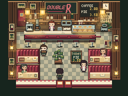
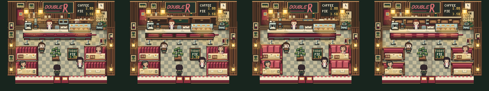

# Double R — disegno, composizione e vita nel tempo

Esperimento isolato su `codex/intent-room-double-r-art` in `.worktrees/intent-room-double-r-art`, derivato dal pilot Double R `31c68f6`. Nessun merge o push.

## 1. ELI12 — prima guarda

Il Double R era già riconoscibile e caldo, ma alcuni volumi sembravano pannelli decorati più che arredi solidi; due gesti locali potevano sovrapporsi e la pulizia del bancone era quasi invisibile a 256×192. Ho costruito tre alternative reali nel renderer. Nessuna ha superato in modo convincente il disegno già approvato: **l'arte statica finale resta quella precedente**. La candidata giocabile cambia invece una piccola scena temporale: sorso, quiete, poi un braccio che percorre il bancone e torna. Il miglioramento temporale è verificabile, ma modesto; non abbiamo prove che un giocatore si fermerà ad ammirarlo.

## 2. Prove visive — immagini a 1×, poi a 4× senza smoothing

| Stato | Nativo 256×192 | Ingrandimento nearest-neighbor | Che cosa mette alla prova |
| --- | --- | --- | --- |
| Base approvata, ingresso `(6,8)`, su | [PNG](../artifacts/intent-room-double-r-art/baseline-native.png) | [4×](../artifacts/intent-room-double-r-art/baseline-4x.png) | Servizio, quattro sedute, due vie attorno all'isola. |
| A — servizio a tre campate | [PNG](../artifacts/intent-room-double-r-art/study-A-native.png) | [4×](../artifacts/intent-room-double-r-art/study-A-4x.png) | Più profondità/ritmo nel fondale e nel bancone. |
| B — grandi alcove imbottite | [PNG](../artifacts/intent-room-double-r-art/study-B-native.png) | [4×](../artifacts/intent-room-double-r-art/study-B-4x.png) | Sedute più riconoscibili da lontano. |
| C — banquette orizzontali | [PNG](../artifacts/intent-room-double-r-art/study-C-native.png) | [4×](../artifacts/intent-room-double-r-art/study-C-4x.png) | Collegare controparte di servizio e ritmo delle sedute. |
| Finale giocabile, arte base + gesto rivisto | [PNG](../artifacts/intent-room-double-r-art/final-native.png) | [4×](../artifacts/intent-room-double-r-art/final-4x.png) | Il singolo frame non prova la vita: guardare video/sequenze sotto. |

Sono tutti frame del renderer del gioco alla stessa risoluzione, camera, ingresso e stato narrativo base: player `(6,8)` rivolto su, Norma `(5,2)`, Log Lady `(4,5)`, Shelly `(9,7)`; James non presente in questa finestra. Gli studi A/B/C sono **prototipi renderer-native**, non versioni giocabili spedite. Il confronto art-only C è conservato [qui](../artifacts/intent-room-double-r-art/candidate-art-only-native.png); la review cieca ha preferito la base. I PNG non sono proof di fluidità.

Confronto controllato: **BASELINE** = arte/vita precedenti; **ART-ONLY** = C prima del ritorno alla base, immagine ma non candidata; **LIFE-ONLY** = finale con arte byte-identica alla base e timing/gesto nuovi; **COMBINED** non costruito, perché sommare arte respinta avrebbe reso il risultato peggiore e meno interpretabile. Stessi UI, audio, camera e scala per le catture reali; l'audio non è stato valutato.

### Scena reale nel tempo

- [Base: sequenza MP4 45 s](../artifacts/intent-room-double-r-art/cdp-baseline-05/stationary/stationary.mp4) · [manifest e timestamp dei PNG](../artifacts/intent-room-double-r-art/cdp-baseline-05/manifest.json) · [gesto bancone, cinque frame 4×](../artifacts/intent-room-double-r-art/cdp-baseline-05/wipe-5frames.png).
- [Candidata: sequenza MP4 45 s](../artifacts/intent-room-double-r-art/cdp-candidate-final/stationary/stationary.mp4) · [manifest e timestamp dei PNG](../artifacts/intent-room-double-r-art/cdp-candidate-final/manifest.json) · [gesto bancone, cinque frame 4×](../artifacts/intent-room-double-r-art/cdp-candidate-final/wipe-5frames.png).
- Confronto **a seed identico 6**: [base MP4](../artifacts/intent-room-double-r-art/cdp-controlled-6-baseline/stationary/stationary.mp4) · [base manifest](../artifacts/intent-room-double-r-art/cdp-controlled-6-baseline/manifest.json) contro [candidata MP4](../artifacts/intent-room-double-r-art/cdp-controlled-6-candidate/stationary/stationary.mp4) · [candidata manifest](../artifacts/intent-room-double-r-art/cdp-controlled-6-candidate/manifest.json). Entrambi PASS: rispettivamente 102/102 e 103/103 frame unici in 45,625 e 45,635 s misurati, medesimo Cast e frame canonico anti-flat superato (919 colori, 78,5% pixel non-base). Il seed controlla solo i due clock già esistenti dopo il bootstrap canonico; non modifica lo stato narrativo o l'arte.
- [Percorso finale ingresso → bancone → sedute → uscita](../artifacts/intent-room-double-r-art/cdp-route-final/manifest.json), con input da tastiera CDP reali e PNG nativi per ogni tappa. [Stato canonico alternativo Act 4](../artifacts/intent-room-double-r-art/final-act4-native.png) · [4×](../artifacts/intent-room-double-r-art/final-act4-4x.png): Maddy e Leland al bancone, James nel corridoio destro; forma della stanza ancora leggibile.

Frame del percorso: [ingresso](../artifacts/intent-room-double-r-art/cdp-route-final/route/t+005173ms-canonical-entrance.png) → [bancone](../artifacts/intent-room-double-r-art/cdp-route-final/route/t+007655ms-counter.png) → [sedute](../artifacts/intent-room-double-r-art/cdp-route-final/route/t+009702ms-booths.png) → [uscita](../artifacts/intent-room-double-r-art/cdp-route-final/route/t+011943ms-canonical-exit.png). Il percorso usa harness spaziale senza Cast bootstrap; solo le catture ferme separate dimostrano Cast canonico.

I due MP4 sono costruiti da PNG del canvas reale e durate **misurate** tra frame, non dai 250 ms nominali. `ffprobe`: 45,12 s base; 45,16 s candidata. Fonte ≈45,5 s ciascuna; campionamento effettivo ≈2,3 frame/s. Questo permette di leggere ordine e pause dei momenti, **non** microfluidità, accelerazioni fini o qualità a 60 fps. I PNG nativi sono prova cromatica; MP4 H.264 `yuv420p` è solo supporto temporale. Una prima codifica accelerata è stata corretta prima della review.

I due video sopra sono run **non seedati**, utili come osservazione naturale. Per la controprova controllata ho scelto seed 6 guardando soltanto i tempi iniziali prodotti dai clock della **base**, prima di vedere immagini: entrambi i gesti dovevano concludersi nei 45 s in Chrome software. Un primo seed provato non li conteneva entrambi e non è stato usato come prova comparativa. Con seed 6, nella base pulizia ≈26,6–30,6 s e sorso ≈28,8–32,7 s si sovrappongono ≈1,8 s; nella candidata sorso ≈24,3–28,3 s e pulizia ≈36,2–40,1 s sono separati da ≈7,9 s. Tempi di parete dalla prima cattura, derivati dai manifest, non ritmi di gioco prescritti.

### Diagnosi del disegno

| Elemento → evidenza | Conseguenza | Intervento esplorato / esito |
| --- | --- | --- |
| Parete di servizio e bancone: massa superiore densa, molte linee parallele; silhouette riconoscibile, ma pochi recessi veri. | Appare talvolta decorazione frontale più che profondità del locale. | A apre tre campate e assottiglia il fronte; perde però macchina/oggetti e ricchezza specifica del Double R. Scartato. |
| Sedute: moduli rossi leggibili, ma fronti/tangenti ai tavoli hanno contatto e spessore deboli a 1×. | Alcune superfici sembrano strisce rosse applicate, non imbottitura. | B aumenta masse e piani: troppo rosa e squadrato. B2/B3 riducono il problema ma reviewer preferisce ancora la base; scartati. |
| Bancone, pie case e sedute: due destinazioni visive valide; l'isola spezza il corridoio. | Un solo punto focale farebbe perdere socialità. | C unifica fasce orizzontali; più ordinato ma riduce profondità/contatti. Critica cieca preferisce base. Scartato. |
| Personaggi e superfici: Norma è ben posizionata dietro il bancone; mano precedente percorreva circa quattro pixel. | L'attività di servizio si leggeva poco; più microdecorazione non aiuterebbe. | Conservato il lavoro sul gesto, non un nuovo oggetto. |

Problema osservabile: contatto/volume delle sedute a risoluzione nativa. Preferenza, non bug: colore esatto del rosso o desiderio di un singolo focal point. La ripetizione delle quattro sedute è architettura del diner, non copia da eliminare. Nell'alternativa B la variazione cromatica forte danneggia gerarchia; nell'A l'ordine formale sacrifica carattere.

Nel frame intero il vetro della pie case mantiene pannelli separati e contenuto visibile; sgabelli cromati hanno basi/piedi riconoscibili, mentre tazze/ceramica sono troppo piccole per giudizio di materiale a 1×. Parete in legno e insegne danno carattere locale, ma l'area fra insegne e banco accumula rettangoli con poche ombre di profondità. L'isola centrale conserva spazio negativo sufficiente per biforcare il cammino, non va riempita. Nessuna tangente nuova di sprite/bancone viene introdotta dal codice statico finale, perché quel codice è invariato.

Review indipendente su PNG anonimi: C raffinato contro base → base preferita, perché C appiattisce la profondità benché semplifichi il ritmo; B2 contro base → base preferita per piani e contatti migliori. Un critico fresco, senza codice o razionale del builder, ha poi classificato tutti e quattro i frame al nativo: **base 8,7/10 > A 8,1 > B 7,8 > C 7,1** rispetto al riferimento approvato. Il suo gap principale per la base è il fondale superiore ancora poco articolato in materiali/ombre. Ho provato anche B3, ma differenza a 1× troppo piccola per una candidata credibile. Nessuna alternativa è stata promossa per accumulo di ritocchi. [Checkpoint delle prove](../artifacts/intent-room-double-r-art/) e commit `448db09`, `c1affd3`, `9c8f98c` mantengono la storia reversibile; `js/retro-authored.js` finale è byte-identico alla base `31c68f6`.

## 3. Inventario: cosa è cambiato davvero

| Area | Finale |
| --- | --- |
| Disegno/asset | **Nessun asset statico spedito.** Tre direzioni renderer-native, più due rifiniture, tutte respinte. Nessun cambio camera, scala sprite, palette definitiva o smoothing. |
| Composizione | **Invariata.** Contatore e conversazioni restano poli paralleli; isola centrale e vie laterali restano. Nessun footprint, mappa, porta o NPC spostato. |
| Animazioni/timing | `booth-sip` primo avvio 15–18 s di clock di gioco; `counter-wipe` 25–28 s. Il braccio compie una corsa più lunga, con panno sulla superficie e ritorno, usando solo metallo/crema già presenti nella palette diner. Il secondo vapore sul bancone passa dal painter a `performance.now()` allo `STEAM_SMALL` già esistente: ownership, pause e disattivazione ora coerenti, guadagno visivo **minimo**. |
| Infrastruttura/test | Harness CDP 256×192 per route e osservazione 30–45 s con Cast Presence, clock e rAF registrati; ricostruzione video con intervalli reali; test di separazione temporale, presenza Norma, pausa/off-map/disattivazione del vapore. Il vecchio test di popolazione Sheriff non blocca più per hash l'intero modulo condiviso di gesti; continua a bloccare atlas e profili Sheriff. |

Questo non amplia `environment.program`. Mappa, collisione, porte, Cast Presence, Narrative Runtime e rendering restano ai loro proprietari precedenti. Gli unici file production modificati sono `js/character-activity.js` e `js/ambient-life-scenes.js`.

## 4. Vita prima/dopo: momenti osservati

Tempo = secondi di parete dalla partenza della cattura ferma, non secondi di clock di gioco (Chrome software avanzava più lentamente). PNG per ogni timestamp nei rispettivi manifest.

La tabella segue i run non seedati; la coppia controllata seed 6 sopra conferma separazione del primo ciclo anche quando i due clock partono dalle stesse condizioni pseudocasuali. Non prova che cicli successivi non si tocchino.

| Momento | Base | Candidata | Interpretazione limitata |
| --- | --- | --- | --- |
| Riflesso nella pie case | Intermittente, osservato nel loop già esistente. | Attivo circa `14,6–19,8 s`; fonte luminosa e vetro restano locali, non lampeggio globale. | Ambient Life era già vivo; non è un miglioramento nuovo. |
| Sorseggiare alla seduta destra | Circa `28,5–32,4 s`. | Circa `21,4–25,3 s`; preparazione, contatto, ritorno distinguibili soprattutto a 4×. | Gesto invariato nel disegno. A 1× riconoscibile solo se si guarda la seduta. |
| Pulire il bancone | Circa `29,8–33,7 s`, **sovrapposto** al sorso; movimento minimo. | Circa `37,2–41,0 s`, dopo intervallo quieto ≈12 s di parete; corsa laterale più ampia e ritorno. | Sequenza più separata e azione locale più visibile, ma ancora sottile a 1×; non prova realismo umano. |

Inventario dei sistemi effettivamente eseguiti: `AmbientLife` registra due vapori di bancone, uno alla seduta, tre pratiche pendenti, neon, macchina caffè, orologio e riflesso pie case; `CharacterActivity` registra il sorso del cliente generico e la pulizia di Norma. Il manifest finale mostra avanzamento dei due clock e frame attivi. I fenomeni di sfondo restano discreti; non ho aggiunto lampi, particelle, clienti, timer o narrativa. `counter-wipe` non si disegna senza Norma al posto `(5,2)`, durante dialogo/menu o fuori dal diner; il test verifica cancellazione e assenza.

| Attività osservata / proprietario | Ritmo e condizione | Lettura dalla camera d'ingresso |
| --- | --- | --- |
| Tre vapori, `AmbientLife.STEAM_SMALL` | Continui, 7 frame su cicli ≈1,2–1,8 s; solo scena diner, pausa/disabilitazione rispettate. | Primo bancone e seduta: segni sottili; secondo bancone migrato: pochi pixel quasi invisibili a 1×. Registrazione ≠ riuscita visiva. |
| Tre lampade, `LIGHT_WARM_VARIATION`; neon, `LIGHT_NEON` | Lampade indipendenti dopo pause 4–12 s, passaggi 1,2–1,6 s; neon raro dopo 8–25 s, 0,7–0,85 s. | Lampade motivano zone calde; variazione poco invadente. Neon resta segno locale, non pulsing dell'intera stanza. |
| Macchina caffè, `MACHINE_IDLE_ACTIVITY`; orologio, `CLOCK_TICK` | Macchina intermittente dopo 8–25 s; orologio avanza di uno scatto di lancetta ogni 5 s di clock simulato. | Macchina/quadrante troppo piccoli per attirare occhio a 1×; prove runtime sì, valore visivo incerto. |
| Pie case, `GLASS_SUBTLE_REFLECTION` | 8 frame in ≈2–4 s dopo pause 5–15 s. | Riflesso visibile nella fascia di servizio, collegato al vetro e non a tutta la stanza. |
| Cliente seduto, `CharacterActivity.booth-sip` | 9 frame, ≈3–3,4 s; cliente generico già disegnato, non Cast nominato. | Tazza/viso leggibili nel crop; a 1× gesto secondario. Pausa iniziale 15–18 s nel finale. |
| Norma, `CharacterActivity.counter-wipe` | 9 frame, ≈2,8–3,2 s; richiede Norma presente, ferma a `(5,2)`, gioco attivo senza dialogo/menu. | Nel finale corsa laterale riconoscibile se si guarda il bancone, ma la linea dell'avambraccio può fondersi col dispositivo grigio. Pausa iniziale 25–28 s. |

Questi intervalli sono definizioni del clock di gioco; i timestamp della tabella sopra sono **misure** di parete nel run Chrome e quindi diversi. Non deduco fluidità da valori di durata o nomi delle animazioni.
Nella cattura candidata il secondo vapore modifica pochi pixel presso lo stesso bicchiere/tazza (`x≈129–130`, `y≈54–59` nel canvas): fatto osservabile ma quasi nullo come lettura a 1×. Non lo conto come miglioramento artistico.
La separazione è garantita nel **primo ciclo**; i clock restano indipendenti e un'eventuale coincidenza in cicli successivi oltre la finestra osservata non è esclusa.

## 5. Esperimenti scartati

A esplora vera articolazione del fondale, ma toglie densità specifica; B dà più massa alle sedute, ma trasforma imbottitura in pannelli rosa quasi piatti; C semplifica la fascia orizzontale, ma appiattisce profondità e contatti. B2 recupera toni e ritorni laterali, B3 migliora solo pochi pixel: il primo perde ancora il confronto cieco, il secondo non giustifica uno shipping. Le immagini restano nel pacchetto prove; il codice finale ritorna alla base. Questa è una decisione **BAR_WINS** sull'arte statica, non un successo nascosto da altri cambiamenti.

## 6. Valutazione separata

| Aspetto | Stato | Evidenza / incertezza |
| --- | --- | --- |
| Qualità del disegno | **Invariata** | Prototipi A/B/C reali; alternative statiche respinte. Debolezza dei contatti di sedute e tavoli ancora visibile. |
| Composizione | **Invariata** | C più ordinata, ma controprova cieca preferisce profondità della base. Le destinazioni sociali multiple funzionano già. |
| Vita/animazioni | **Migliorata lievemente** | Momenti sorso e pulizia non coincidono più nel primo ciclo; gesto bancone ha corsa visibile. Review temporale e playtest restano necessari. |
| Leggibilità giocando | **Invariata; percorso verificato** | CDP attraversa ingresso, bancone, sedute, uscita; a 1× il gesto resta secondario e non copre il giocatore. |

Nessun voto unico di “bellezza”. Nessun risultato di pubblico inventato.

## 7. Test, prestazioni e limiti

| Prova | Risultato |
| --- | --- |
| Node 24 CI suite dopo commit | **100/101**. Unico fail `test/narrative-validate-m10.js`, quattro chiavi verbatim; ho rieseguito lo stesso test nel worktree base `31c68f6` e ottenuto le stesse quattro. Nessuna modifica narrativa qui. [Report](../artifacts/intent-room-double-r-art/release-node24-committed/report.json). |
| Test mirati | `character-activity`, `ambient-life`, `ambient-life-frames`, `diner-layout`, `diner-program`, `station-population`, `retro-production`, smoke e walkthrough passano nella suite o separatamente. |
| Route Chrome CDP finale | **PASS**, ingresso esterno → bancone → corridoio sedute → uscita, input reali, collisione/porte immutate. |
| Catture canoniche | Base 45,527 s, 106 frame / 105 unici, 861 rAF; candidata 45,665 s, 107/107, 863 rAF. Tutti gli invarianti dimensione, visibilità, camera ferma, Cast Presence e clock veri. Nella candidata gli item Ambient Life restano 10→10 e Character Activity 2→2 lungo la finestra: nessun accumulo osservato. |
| Costo misurato | rAF osservati ≈18,9/s in entrambi i run su Chrome headless SwiftShader dello stesso host; differenza non risolutiva. Questo **non** misura fps reale su macchina giocatore né dimostra impatto nullo. |
| Chrome Act 3, tre percorsi | **189/189 PASS**, guida a tasti reali; le osservazioni di obiettivo non mostrato sono diagnostiche del harness, non assert fallite. Il harness ha registrato un generico `Failed to load resource: 404`; nessun URL nel log, quindi non lo classifico come innocuo senza prova. [Asserzioni](../artifacts/intent-room-double-r-art/act3-browser-assertions.json). |
| Chrome Act 4, quattro percorsi | **530/530 PASS**. Route C entra/esce dal diner a piedi; Cast Maddy/Leland presente prima del taxi e assente dopo, come registro. Unico errore console: `favicon.ico` 404 del server test, registrato dal harness. [Asserzioni](../artifacts/intent-room-double-r-art/act4-browser-assertions.json). |

Non verificati: fluidità a 60 fps, audio, risposta di giocatori, prestazioni su mobile fisico. Lo stato alternativo Act 4 è una prova di composizione/occlusione in un frame, non un reel temporale alternativo; l'assenza di Norma è coperta dal guard comportamentale, non da video. La suite automatica verifica pause/disabilitazione e guard di dialogo, ma non sostituisce una prova manuale di naturalezza. Nessuna impostazione `prefers-reduced-motion` è stata trovata nel renderer production 2D (i soli match locali sono prototipi 3D); non ne ho inventata una in questo pass. Nessun comando tocca layout, porte, collisione o stato narrativo canonico.

## 8. Playtest umano proposto, senza partecipanti inventati

Aprire la candidata dall'ingresso normale senza istruzioni di “guardare la stanza”. Lasciare controlli liberi e osservare primo sguardo, prime scelte di movimento, sosta spontanea e uso del bancone/sedute; non imporre attesa. Dopo l'uscita chiedere: “Che cosa ricordi del locale?”, “Hai visto qualcuno fare qualcosa?”, “Il movimento ti sembrava naturale o distraeva?”, “Ti sei fermato per interesse, per orientarti o perché eri bloccato?”. Il tempo dentro non basta come misura di bellezza. Ripetere con base in ordine controbilanciato, stesso audio/UI e nessuna spiegazione delle differenze.

## 9. Note per l'articolo futuro — ipotesi, prove, fallimenti, fonti

### Review, ownership e decisioni

Luna xhigh ha tracciato renderer/life e costruito solo harness/migrazione meccanica assegnati. Il modello principale ha scelto A/B/C, valutato i PNG nativi e tenuto/rifiutato la candidata. Due critici indipendenti hanno visto confronti statici anonimi, seguiti da un critico fresco su tutti e quattro i PNG; nessuno ha promosso alternativa contro base. Un reviewer temporale indipendente ha trovato la candidata **marginalmente** più leggibile: panno/braccio riconoscibili nel strip a 1×, quasi assenti nella base. Ha anche visto un difetto residuo: avambraccio molto rettilineo che si fonde per due frame con il macchinario grigio. Ha potuto leggere direttamente il video della candidata, ma non riprodurre con affidabilità quello base: il confronto del ritmo resta basato sui frame nativi campionati, non è un verdetto full-motion. Nessun reviewer è trattato come misura di esperienza umana. La migrazione del vapore non è una prova di “stanza più viva”: evita un clock parallelo e rende il segno governato da pausa/uscita, ma è quasi invisibile a scala normale.

Una review ostile del diff ha trovato tre lacune concrete: cattura capace di accettare canvas piatto, vapore non verificato al depth del bancone, traiettoria del panno non verificata in pixel. Ho aggiunto gate anti-flat al frame canonico, test del depth slice `64` e assert dei tre punti del panno (partenza/reach/ritorno). Rimane limite: test di profondità esercita Ambient Life e la cattura CDP mostra la scena finale, ma non c'è una golden image per il singolo pixel del vapore nel painter completo. Il reviewer non ha trovato ownership duplicata o timer paralleli rimasti.
Ha anche segnalato il costo di togliere l'hash byte-per-byte di `character-activity.js` dal test storico Sheriff: il controllo dei profili e i test comportamentali coprono il caso attuale, non ogni futura modifica del motore condiviso. Questa protezione più stretta resta un debito di test, non una garanzia dichiarata.

La checklist del protocollo locale Gauntlet è stata completata **durante l'integrazione**, non prima di ogni prova; l'audit preflight ora passa e le prove principali hanno hash. Non riceve però pass di rilascio: l'arte nuova non vince contro la base e la vita non ha un voto numerico indipendente o playtest umano. Il contratto non è stato allentato per ottenere un'etichetta verde.

### Appunti verificabili

- Ipotesi statiche: più recessi di servizio (A), sedute di maggiore massa (B), fascia di banquette unificante (C). Renderer-native e review cieca non sostengono un miglioramento finale; dato negativo utile, non un caso di successo estetico.
- Ipotesi temporale: separare lavoro del personale e gesto del cliente può rendere la stanza meno meccanica senza aggiungere effetti. Manifest con timestamp mostra primo ciclo non sovrapposto e braccio più leggibile; giudizio umano assente.
- Errore strumentale scoperto: MP4 iniziale usava intervallo richiesto anziché misurato. Correzione documentata e `ffprobe` verificato prima del confronto. Le sequenze restano campionate, quindi niente claim su easing/fps.
- Fonti effettivamente consultate: [report del pilot Double R](intent-room-double-r.md), [Room Critic](../docs/environment-program-room-critic.md), [World Visual Bible](../docs/world-visual-bible-v0.1.md), [arte approvata](../artifacts/diner-final-art/final.png), renderer/scene/life/test locali e catture nuove. Nessun paper esterno usato; non attribuire risultati a ricerca accademica.

## 10. Collo di bottiglia successivo — uno solo

**Qualità del disegno dei volumi/contatti a 1×.** La base regge meglio di tre riorganizzazioni rapide; i pixel di sedute, tavoli, bancone e persone non guadagnano solidità solo riordinando fasce o cambiando colore. Prossimo esperimento, separato da questo: studio di pochi asset con piani, spessori, occlusioni e contatto disegnati da artista/critic esperto, verificato subito nel frame nativo. Non aggiungere schema, clutter o nuovi effetti per mascherare il limite.
