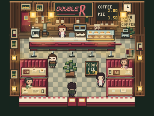
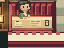
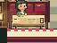
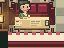
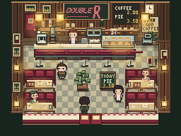
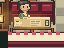
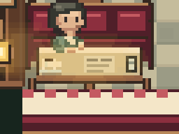
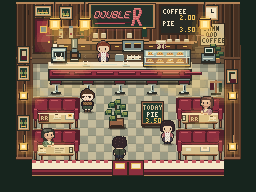
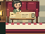

# Double R — artigianato pixel di booth e tavolo

Esperimento sul branch `codex/intent-room-double-r-art` dopo `7472a39`. Scope: un modulo booth/tavolo e sua ripetizione, non stanza intera. Arte/life precedente congelata; mappa, collisione, porte, Cast, narrativa, camera, sprite, Program immutabili.

## 1. ELI10

Base già compone bene quattro booth e bancone. Problema nuovo: a 256×192 seduta e tavolo sembrano talvolta un unico mobile frontale. Astra ha proposto cinque costruzioni, Luna ha realizzato tre studi e una rifinitura nel vero renderer. Il tavolo nuovo aveva geometria più esplicita, ma **due critici ciechi e il lead hanno giudicato il booth complessivo meno convincente a 1×**. Arte finale torna alla base; nessuna vittoria visiva rivendicata. Il risultato utile è sapere che una spec fisicamente sensata non equivale a pixel art migliore.

## 2. Problema nella base

Riferimento approvato: [crop golden 5×](../artifacts/intent-room-double-r-craft/packet/booth-table-reference-final-5x.png). Non è soluzione già pronta: condivide costruzione frontale della base. Valore forte da preservare: compatta massa borgogna, contrasto crema, ospite leggibile.

Nel renderer, backrest a righe verticali; seduta scura quasi tutta coperta da piano crema esteso per 42 dei 48 px; fianco e bordo inferiore continuano uno nell'altro. Topologia percepita ambigua: tavolo autonomo o fascia chiara del booth? 1× non beneficia da ulteriori micro-righe. [Packet con provenienza e stati](../artifacts/intent-room-double-r-craft/packet/manifest.json) distingue ospiti generici authored da Cast: disattivare Named Cast non svuota booth occupato. [Booth pronto](../artifacts/intent-room-double-r-craft/packet/booth-0-top-left-empty-ready-native.png) e [booth sparecchiato](../artifacts/intent-room-double-r-craft/packet/booth-3-bottom-right-empty-cleared-native.png) coprono altri stati.

Vincoli: ogni modulo 48 px; quattro footprint da `map.interior`; tavoli solidi e backrest solidi nelle righe canoniche; guest disegnato prima del tavolo, mani dopo. Solo `js/retro-authored.js` possiede quei pixel. Nessuna seconda fonte per coordinate/collisione.

## 3. Cinque studi Astra

| Studio | Costruzione, non colore | Piani / spessore / contatto | Rischio |
| --- | --- | --- | --- |
| A | Panca continua, seduta visibile ai lati del tavolo più stretto. | Ali borgogna e labbro scuro; bordo tavolo in legno, piedi separati. | Stoviglie ai margini potrebbero perdere appoggio. |
| B | Guance imbottite sagomate che girano in avanti. | Cappucci superiori, faccia interna/esterna e piedi corti; tavolo incorniciato. | Grandi luci rosa ricreerebbero vecchio B scartato. |
| C | Telaio di legno con cuscini borgogna incassati. | Giunti visibili e piedi, tavolo indipendente entro estremità. | Legno dominante: panca ecclesiastica anziché diner. |
| D | Lastra tavolo indipendente sopra vano gambe aperto. | Top crema, bordo/underside in legno, piedistallo e due piedi panca. | Vano troppo scuro/striscia nera a 1×. |
| E | Cuscini orizzontali e tavolo a spigoli scalettati. | Tre grandi fasce e angoli che espongono tasche di seduta. | Divano generico, soluzione orizzontale già piatta in precedente prova. |

Lead seleziona A, B, D perché interrogano tre cause diverse: seduta coperta, silhouette laterale, autonomia del piano. C/E respinti **come concetti** per rischio fondamentale di identità/lettura; non scambiati per fallimenti di esecuzione. Astra high ha dato direzione; Luna xhigh costruisce pixel/test; lead giudica 1× prima di revisore cieco. Studi iniziali non vanno bocciati solo perché meno rifiniti della base.

## 4. Studi implementati

### A — seduta ai lati e tavolo indipendente, `e096ed0`

Anche [pronto](../artifacts/intent-room-double-r-craft/A/booth-0-ready-native.png), [sparecchiato](../artifacts/intent-room-double-r-craft/A/booth-3-cleared-native.png), [senza Named Cast](../artifacts/intent-room-double-r-craft/A/study-A-unpopulated-native.png) e [Act 4](../artifacts/intent-room-double-r-craft/A/study-A-act4-native.png). [Manifest/hash](../artifacts/intent-room-double-r-craft/A/manifest.json).

Primo giudizio lead: **PROMISING BUT UNDER-REFINED**. Il vuoto fra piedi e supporti stacca davvero tavolo da panca; bordo in legno leggibile e stesse stoviglie appoggiano. Però ali della seduta restano ~3 px e a 1× il volume imbottito è ancora debole; tre larghi pannelli dello schienale possono leggere come boiserie anziché cuscini. Nel frame intero perde parte del ritmo fine originale. Non chiedere ancora al critico cieco se è “più bello”: prima B/D e rifinitura comparabile.

Review meccanica indipendente di `e096ed0`: nessun problema materiale. Rettangoli entro envelope precedente, stoviglie sul nuovo top, mani disegnate dopo, supporti senza sovrapposizione; sistemi canonici invariati. Non è un giudizio estetico.

### B — guance imbottite sagomate, `b8146bb`

[Pronto](../artifacts/intent-room-double-r-craft/B/booth-0-ready-native.png) · [sparecchiato](../artifacts/intent-room-double-r-craft/B/booth-3-cleared-native.png) · [Act 4](../artifacts/intent-room-double-r-craft/B/study-B-act4-native.png) · [manifest](../artifacts/intent-room-double-r-craft/B/manifest.json). B parte dal helper originale, non da A. Primo render aveva menu/piatto parzialmente fuori dalla lastra; corretto **prima** del checkpoint allargando slab di 2 px e spostando prop lato destro 1 px, poi ricatturato.

Giudizio lead: **PROMISING BUT UNDER-REFINED**. Le due guance danno sagoma di arredo più robusta a 1×; ospite rimane integrato. Però estremità scure e piedi dominano, tendono a incorniciare una grande faccia crema come mobile/armadio. Il bordo seduta non è ancora un piano convincente; non promuovo B solo per maggiore massa. Review tecnica indipendente: nessuna fuga da envelope, palette/ownership, props ora supportati, mani sopra tavolo, sei gate mirati verdi.

### D — lastra sopra vano gambe, `bb11057`

[Pronto](../artifacts/intent-room-double-r-craft/D/booth-0-ready-native.png) · [sparecchiato](../artifacts/intent-room-double-r-craft/D/booth-3-cleared-native.png) · [Act 4](../artifacts/intent-room-double-r-craft/D/study-D-act4-native.png) · [manifest](../artifacts/intent-room-double-r-craft/D/manifest.json). D parte dal helper originale, non da B. Tutte stoviglie entro lastra.

Giudizio lead: **REJECT come soluzione completa del booth**, ma principio di spessore del piano utile. Bordo e piedistallo sono distinti; il vuoto sotto misura pochi pixel e al nativo non cambia abbastanza la lettura della seduta. Schienale rimane frontale. Non sommerò un risultato parziale a un voto estetico immaginario.

Review indipendente D: 12 combinazioni booth/ospite, 1.135 rettangoli, zero fuori envelope; props supportati, mani non coperte dai sostegni; solo renderer differisce dai sistemi canonici. Sei gate mirati verdi.

## 5. Percorso di refinement

**Astra A → critica lead → Astra R → Luna implementation.** A dà autonomia al tavolo ma solo ~3px di seduta visibile; B mostra che guance da 5px reggono il nativo, ma telaio scuro diventa armadio; D isola il piano, ma 2–3px di vano gambe non bastano. Seconda chiamata Astra high ha quindi specificato una sola candidata R: tre cuscini con roll inferiore e highlight corto, guance borgogna da 5px, lastra x+6..41 più sottile (top y+1..9, bordo y+10/11), stoviglie rialzate 1px e quattro piedi/legni con contatti locali. [Spec implementabile](../artifacts/intent-room-double-r-craft/refinement-spec.md). Luna l'ha eseguita in `d9c7ac6`, senza alterare layout o vita.

[Pronto](../artifacts/intent-room-double-r-craft/R/booth-0-ready-native.png) · [sparecchiato](../artifacts/intent-room-double-r-craft/R/booth-3-cleared-native.png) · [Act 4](../artifacts/intent-room-double-r-craft/R/study-R-act4-native.png) · [manifest/hash](../artifacts/intent-room-double-r-craft/R/manifest.json). Lead l'ha giudicata pronta per confronto, non automaticamente migliore. Due review cieche fresche hanno visto soltanto [PNG anonimi](../artifacts/intent-room-double-r-craft/blind/) e golden: entrambe hanno preferito **opzione 2 = base** su opzione 1 = R. [Verdetti e rubric](../artifacts/intent-room-double-r-craft/blind/reviews.md): primo R 6/10, base 10/10; secondo R 7/10, base 10/10, con cinque criteri 0–2. Voti soggettivi, non sola ragione della decisione. Osservazione convergente: cuscini verticali base articolano meglio volume; R crea grande parete rossa e fasce orizzontali, pur avendo tavolo più logicamente separato. Nessun critico ha visto codice o storia degli studi.

## 6. Finale prima/dopo

Nessuna modifica statica spedita: helper booth/tavolo ripristinato byte per byte rispetto alla base approvata in `4dfb9c8` (`git diff --exit-code 7472a39 -- js/retro-authored.js` PASS). Le catture A/B/D/R sopra mostrano cambiamenti reali. Arte finale [nativa](../artifacts/intent-room-double-r-craft/final-native.png), SHA-256 `f4605dc6a101511495c4b56098ba10704380733e65956cf543b795e297fd10c7`; [base nativa](../artifacts/intent-room-double-r-craft/packet/normal-populated-native.png), SHA-256 `84ba070a78a264e3b56f37f154ae46915205b4052f7ed0c1702ee2fbb1b03bd4`; [crop base occupato](../artifacts/intent-room-double-r-craft/packet/booth-table-populated-native.png) e [4×](../artifacts/intent-room-double-r-craft/packet/booth-table-populated-4x.png). Confronto PNG completo: 12 pixel diversi in quattro minuscole zone di actor/ambient, coerenti con fase temporale non bloccata; non rivendico identità dell'intero frame pixel per pixel. [Stato Act 4 della base](../artifacts/intent-room-double-r-craft/packet/act4-maddy-leland-native.png). Il precedente miglioramento temporale resta separato e intatto.

## 7. Cosa migliora davvero

Valutazione **R rispetto alla base**, non dichiarazione sul finale ripristinato:

| Proprietà | Stato | Evidenza nativa |
| --- | --- | --- |
| Silhouette | UNCERTAIN | Piedi/guance più separati; massa del retro più uniforme. Critici assegnano pareggio o vantaggio base. |
| Volume | WORSE | Tre cuscini larghi diventano pannelli; ribbing base rende imbottitura più leggibile. |
| Piani | WORSE | Lastra/tetto meglio definiti localmente, ma schienale perde articolazione prevalente. |
| Contatto | UNCERTAIN | R mostra gambe distinte e pavimento, ma a 1× critici leggono bordo inferiore base come più solido. |
| Materiali | WORSE | Base separa più chiaramente imbottitura, piano crema e fascia inferiore nel contesto. |
| Pixel clustering | WORSE | Cluster R più grandi ma troppo omogenei; dettagli base costruiscono ritmo senza collassare. |
| Integrazione ospite/stati | UNCHANGED | Test e crop mostrano mani/props coerenti; entrambi i critici danno 2/2. |
| Lettura a 1× | WORSE | Differenza giusta per il codice non produce miglior booth percepito nel frame intero. |

**Finale ripristinato:** tutte queste proprietà `UNCHANGED` rispetto alla base; non si sommano pregi parziali di versioni scartate.

## 8. Direzioni respinte

A: autonomia del tavolo ma perdita di trama imbottita; B: guance efficaci ma telaio da armadio; D: piedistallo e vano troppo piccoli; R: compromesso fisico più coerente ma cuscini/piatto non reggono il confronto cieco a 1×. C ed E erano concept non implementati: C rischiava troppo legno/identità da panca; E riproponeva horizontal bands già fallite nel pass precedente. Studi e commit conservati per analisi, nessuno spedito.

## 9. Test

A, B, D, R: `diner-layout`, `diner-program`, `retro-production` (54/54), `interior-prop-semantics` (24/24), smoke, walkthrough (415), `git diff --check` tutti PASS a ogni checkpoint. Review indipendenti A/B/D: envelope, props, mani, ownership, diff senza problemi materiali. R: probe 120 combinazioni booth/ospite/attività, 13.742 rettangoli, zero fuori envelope/non interi o stoviglie non supportate; mani e sostegni disgiunti, depth canonico intatto. Dunque **bocciatura artistica, non bug di implementazione**. `test/double-r-location-native.js` fallisce con `Location preview: movement timed out` in base intatta `31c68f6` e worktree pre-edit, 2/2 run ciascuno in ≈3,16 s: debito preesistente, non regressione dell'arte.

Suite Node 24 sul candidato R: **100/101**. Unico fail `narrative-validate-m10.js`, stesse quattro chiavi verbatim già riprodotte nella base del pass precedente; [report](../artifacts/intent-room-double-r-craft/release-node24-R/report.json). Esecuzione accidentale con Node 26 dal PATH: **99/101**, fail narrativo più `character-runtime-contract.js` sull'atlas; [report separato](../artifacts/intent-room-double-r-craft/release-node26-R/report.json). Una verifica indipendente nella base invariata `31c68f6` ha riprodotto il fail atlas con Node 26 e PASS con Node 24: differenza byte PNG IDAT dovuta a zlib 1.2.12 contro 1.3.1-e00f703 per cinque actor sheet; non regressione di questo pass. Chrome route/Act 3/Act 4 finale: in corso.

## 10. Costo / modelli

Main orchestrator: ownership, packet review, diagnosi, scelta A/B/D, critica a 1× e decisione finale. Il runtime non espone identità modello del main: ruolo Sol richiesto, non attestazione di chiamata Sol. Astra `gpt-6-astra` high: **2 chiamate** — cinque costruzioni e una rifinitura R esatta. Luna `gpt-5.6-luna` xhigh: traccia renderer/footprint, catture/manifest, quattro implementazioni meccaniche, timeout di baseline, review di sicurezza e due critiche cieche fresche. Nessuna Astra per test/search/edit. Nessuna stima di token inventata. Divisione economica utile per isolare giudizio e lavoro ripetibile; fallimento di qualità non prova che chiamate più costose da sole basterebbero. Fallback: main model ID non verificabile, ruolo orchestratore esercitato senza fingere Sol eseguito.

## 11. Prossima decisione

**C — STOP.** Booth non supera base; niente pass counter/backbar. Collo di bottiglia: trasformare ragionamento fisico/semantico in cluster pixel che appaiano solidi **al nativo**. Non sono bloccanti renderer, palette o numero di pixel: stessa base dimostra artigianato migliore nello stesso envelope. Implementazione R fedele alla spec, quindi non basta attribuire fallimento a Luna. Prossima prova separata richiederebbe thumbnail/pixel layout visivo direttamente a 1× da artista forte o guida umana, prima di scrivere rettangoli testuali; non parte di questo run.
