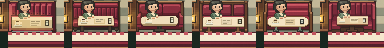
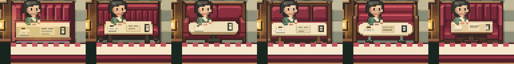
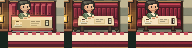

# Double R — visual-first booth experiment

## 1. ELI10 / outcome

Built-in image editing produced five different booth pictures and one refinement. It **did not produce a better game-ready booth**. At the game's 1× scale, the promising study does not clearly beat the current art; its smooth, off-grid pixels also change the guest and surrounding room. We stopped at the required pre-code visual gate. No renderer, collision, story, animation, or Program code changed. Outcome: **ART FAILURE**, not an image-generation outage or image-to-code failure.

## 2. Art packet and constraints

[Full packet](../artifacts/intent-room-double-r-visual/packet/ART_PACKET.md) contains the fresh [whole-room baseline](../artifacts/intent-room-double-r-visual/packet/baseline-populated-native.png), [occupied booth](../artifacts/intent-room-double-r-visual/packet/booth-lower-left-occupied-native.png), empty-ready, cleared, alternate Act 4 states, 4× views, and approved golden reference. [Constraints](../artifacts/intent-room-double-r-visual/packet/CONSTRAINTS.md) record footprint, palette, draw order, character/hand overlap, and gameplay limits. [Visual brief](../artifacts/intent-room-double-r-visual/VISUAL_BRIEF.md) asks for clearer seat/back/table volume and contact while preserving rhythm and native craft. Static renderer baseline was byte-identical to previously approved art; temporal-life work was left alone.

## 3. Astra A–E: actual images

[Raw images, exact prompts, derivation, and color counts](../artifacts/intent-room-double-r-visual/studies/STUDY_NOTES.md). These are image-generated bitmap studies, not renderer captures. A: upright channels and separate table legs, **PROMISING**. B: broad cushions/pedestal but missing menu, **REJECT**. C: framed pads and trestle, too busy, **REJECT**. D: horizontal rolls and rounded table, perspective/material drift, **REJECT**. E: winged upholstery and narrow table, **PROMISING**, but weaker 1× structure than A. None is **STRONG**. Whole-room [A](../artifacts/intent-room-double-r-visual/comparison/whole-room-A-mockup.png) and [E](../artifacts/intent-room-double-r-visual/comparison/whole-room-E-mockup.png) are explicit **art mockups**, not game renders: entire generated crop was pasted into the frame, including altered actor/background pixels.

## 4. Selected design and 5. refinement

A was selected **for one visual refinement**, not approved for implementation. Its table legs and back channels offer the clearest alternative to the baseline's broad frontal color bands. E's seat return is interesting, but its table/seat contact is less legible at 1×. Astra refined A once as A2 to reduce the dark void and clarify seating/table contact. [A2 raw image and provenance](../artifacts/intent-room-double-r-visual/refinement/A2/PROVENANCE.md). This one refinement did not cross the visual gate.

A2 still changes guest face/hands, table markings, wall and floor; its native proxy has 1,372 colors in 64×48, versus the compact baseline palette. Raw A2 has 48,765 colors at 1448×1086. Native proxy is a direct point sample, **not** a hand-corrected pixel asset. It suggests furniture shape, but not a reproducible target matching game's pixel density or invariants.

## 6. Image → code translation and 7. final comparison

**Not attempted**, by design. Required Phase 8 question—“is mockup clearly better in several important ways at native size?”—was answered **no**. Implementing a visually unapproved target would repeat the prior mistake. Thus there is no Astra-target-vs-game-render comparison, no new game-render “after,” and no honest three-way BASE | MOCKUP | IMPLEMENTATION panel. Production **before and after are identical**: [unchanged baseline whole-room game capture](../artifacts/intent-room-double-r-visual/packet/baseline-populated-native.png). BASE | A | A2 contact sheets above are the human-useful art comparison; A/A2 are mockups only.

## 8. Quality breakdown — A2 versus approved baseline

| Criterion | Verdict | Evidence at native scale |
|---|---|
| Silhouette | UNCERTAIN | Taller channeled back and exposed legs help isolated shape; module becomes taller/busier. |
| Volume | UNCERTAIN | More explicit table supports, but dark underside and seat contact remain ambiguous. |
| Seat/back/table planes | UNCERTAIN | Table is visually more independent; seat plane is not convincingly clearer. |
| Floor contact | UNCERTAIN | Legs visible, but their dark mass and shadow do not yield a stronger whole. |
| Material | WORSE | Generated table/guest/background shading blends with upholstery at 1×. |
| Pixel clustering | WORSE | Gradients and off-grid resampling create many incidental values/clusters. |
| Native readability | WORSE | Baseline's economical forms are cleaner in the 64×48 contact. |
| Whole-room integration | UNCERTAIN | A/E mockups alter surrounding pixels; no trustworthy four-booth in-game render exists. |

No compelling multi-criterion win. **Visual gate failed; stop.**

## 9. Failure attribution

Primary: **ART MODEL / constrained native-pixel craft**. Tool generated distinct visual furniture ideas, but did not preserve exact source pixels, footprint, character, props, low-color clusters, or room context despite edit/reference prompts. Secondary: image-edit interface gives a high-resolution bitmap rather than source-grid or layer/region constrained edits. **Not attributed to image→code translation**: translation never began. **Not attributed to renderer constraints**: no implementation was tested. **Room context remains unproven**, because only coarse pasted mockups exist, not four-booth game renders.

## 10. Tests and safety

All production source and canonical data remain unchanged on this branch. Packet capture covered occupied, empty-ready, cleared, and Act 4 states. Fresh baseline checks passed: `node test/smoke.js` (415 checks), `node test/walkthrough.js` (85 acquisitions; finale reached), `node test/diner-layout.js`, `node test/diner-program.js`, `node test/retro-production.js` (54/54), `node test/ambient-life.js`, `node test/ambient-life-frames.js`, `node test/character-activity.js`, `node test/character-quality.js`, and `node test/retro-contact-shadow.js` (10/10). `node test/character-runtime-contract.js` fails on five character mismatches (`truman`, `jacoby`, `audrey`, `maddy`, `bob`); Luna reproduced the same failure on base commit `5b65591`, so it is pre-existing. Diff against that base confirms no changes under `js/`, `test/`, `world/`, `index.html`, or `tools/`. No translation means no new depth, overlap, route, or four-booth regression to test. No blind comparison was run: protocol places blind review only after an approved image is implemented and comparably polished. Chrome route was not run after Phase 8 stop; do not infer it passed.

## 11. Models, calls, cost discipline

- Lead/orchestrator: repository isolation, packet verification, visual gate and failure attribution. Current top-level runtime model identity is not asserted as “Sol.”
- Astra (`gpt-6-astra`, high): image-first art direction, five distinct built-in image-editing calls A–E, one refinement call A2. Image tool itself exposes no model selector; raw C2PA identifies `gpt-image` 2.0 for A. No invented token/cost figures.
- Luna (`gpt-5.6-luna`, xhigh): bounded packet, constraints, contact/comparison, and baseline test tasks. It did not select art direction or implement code.
- Fallback: none to text-spec implementation. Built-in image generation was available and worked. No renderer translation after visual gate failed.

## 12. Research note

Previous failure was not **solely** the prose-to-code handoff. Direct image creation removes that handoff and yields richer furniture concepts, but current tool still fails exact native-grid control and preservation of actors/context. Next experiment, if approved, should test constrained 64×48 sprite-region/layer editing or a human pixel-art pass **before** renderer translation. This report is internal research, not a public article. Do not advance to counter/backbar from this result.
