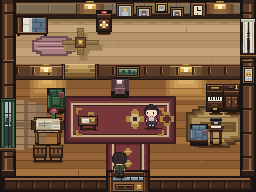
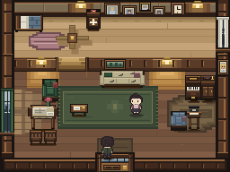
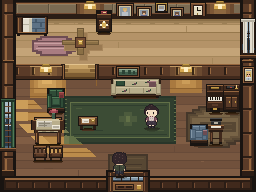

# I called it a sofa. The room didn't.

Our Palmer house had chairs, rugs, wood panelling, a piano and a table with a cup on it. It wasn't missing furniture. Looking at it from the front door, though, the living room felt like a collection of little objects around a very important carpet.

The carpet had a bright border and several gold motifs. The seats were small. The first thing I wanted to fix was the relationship between them, not the amount of detail.

Then I looked at the object named `sofa`.

It occupied one tile. The drawing was a single armchair. The code's comment was quite sensible: don't draw a big sofa where the player can walk through it. But that meant the room had inherited a design decision disguised as a technical constraint. We had kept the name and lost the thing.

*Before. Full game frame, including the upstairs room. Nothing was removed to make this look worse.*

## Start with a visit, not an inventory

I used the room the way a visitor would: enter through the real door and look ahead. This is a family sitting room. You should be able to recognize where people sit together, walk over to Sarah, or continue toward the stairs.

That gave the work a short brief: make the seating read as one place, keep the arrival space open, and let the dining and music corners remain secondary.

Notice what that brief doesn't say. It doesn't demand a useful job for every pixel. The floral upholstery can be there because it makes the room feel domestic. A rug can earn its place by bringing separate shapes together. Empty floor can be valuable because it lets you arrive without immediately squeezing past furniture.

Henry Jenkins's [Game Design as Narrative Architecture](https://web.mit.edu/~21fms/People/henry3/games%26narrative.html) is helpful here: space can carry associations and create the setting for events, rather than explaining everything in dialogue. That doesn't require us to invent a dramatic backstory for every cup. In this room, recognizing an ordinary sitting area is already doing some work.

## The first change needed more space, not more pixels

I gave the sofa three tiles against the rear wall. The existing chair took the old single-seat position on the west side. The table stayed toward that side of the group; Sarah's standing space and the approach to the stairs stayed clear.

This changed the actual map, not just the picture. Two previously open cells became part of the sofa's collision footprint—the invisible boundary that prevents the player from walking through furniture. The drawing and that boundary had to agree.

There was still the same number of furniture definitions. We didn't solve the room by adding a plant to every gap.

*First pass. A broad cream seat now backs the shared green rug. The chair and table remain smaller shapes beside it.*

I also lowered the carpet's contrast. Its border became thinner and less bright; the repeated badges became a softer central motif. The long entrance runner became a modest mat, with bare floor between it and the sitting area.

That bare strip matters. The old rugs almost formed a decorated corridor. The new gap makes the entrance a place to arrive before joining the room.

In art terms, this is **massing**: the size, position and weight of the big shapes. You can test it without understanding the term. Cover the tiny details with your hand. Can you still tell where the room's main group is?

Valve's [Illustrative Rendering in Team Fortress 2](https://cdn.fastly.steamstatic.com/apps/valve/2007/NPAR07_IllustrativeRenderingInTeamFortress2.pdf) describes deliberately limiting visual noise and repetition while preserving readable shapes. I borrowed that principle, not its visual style. At this resolution, a bright rug border can compete with a person surprisingly easily.

## Light had to belong to something

The first pass was clearer, but the floor still had detached rectangles of light. They looked more like painted patches than something entering a room.

The next pass connected the west window to the floor and the rug with one diagonal light plane. Small breaks correspond to visible blind slats. Where the light reaches the rug, it uses the rug's colors, rather than covering it with an opaque golden sticker.

*Final daytime frame. The window, dining edge and shared rug now have a visible relationship.*

For evening, I used the game's existing Act 4 flag. The window and living-room floor darken, the daylight beam disappears, and the warm wall lights remain. Furniture doesn't move. No new clock or lighting manager was needed.

The upstairs room stays unchanged in both versions. That's a real limitation of this pass: its pale floor still occupies a large part of the camera. I kept the whole frame in these comparisons rather than cropping away the unresolved part.

## What survived the walk?

The native room test walks the engine through the sitting area, music corner, stairs and upstairs investigation. It checks furniture bounds, collision and drawing order, including whether furniture can cover Sarah or cut across the entrance. The evening checks also verify that drawing reads story state without changing it.

The focused production-browser walk passed all 22 checks, including a real entrance from town, Sarah's dialogue, an exit and an evening return. The broader release run had two failures that also occurred on unchanged main. The full Act 4 browser run was not a clean pass either: local resource-loading errors broke parts of it. Those failed results stay in the [technical report](room-method-palmer.md); this is not a release certification.

Even the passing checks are compatibility evidence, not a beauty score. Nobody has yet confirmed that the new arrangement feels better to play.

My visual verdict is narrower: the lower room now has a recognizable shared seat and a quieter floor supporting it. The table remains left-biased; the music corner is compressed; the upstairs expanse still competes for attention. This is a candidate worth putting in front of a person, not a finished theory of beautiful rooms.

If you want to try the process on your own scene, keep it small:

1. Save the real entrance view before touching anything.
2. Describe what a visitor should understand in two sentences.
3. Find one big shape whose drawing, size or placement contradicts that intent.
4. Change its real footprint if necessary, then make surrounding shapes support it.
5. Walk the routes again and compare the same camera. Write down what remains weak.

The useful discovery here wasn't that sofas need three seats. It was that an asset label, a good intention and a passing collision test can all coexist with a room that still doesn't communicate what you meant. You have to look at the place they make together.
